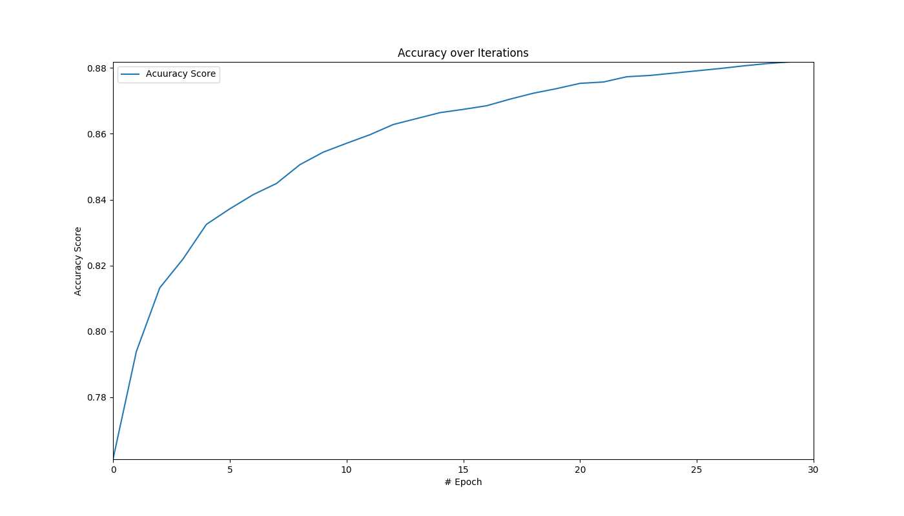

---

typora-copy-images-to: media
---

# Mastering Tensorflow 1.x

## Tensorflow 101

### TensorFlow 的三个模型

Tensorflow有三个模型：

* 数据模型：数据模型由tensor组成。就是Tensorflow程序中数据单位的增加，操作和存储。
* 程序模型：程序模型由数据流图或者计算图组成。Tensorflow中创造一个程序就是建立一个或者多个Tensorflow的计算图。
* 执行模型：执行模型是根据输入值，从初始节点开始，依据依赖条件各个节点依次触发。这种触发仅依赖于输入。

在项目中使用Tensorflow，也就是学习使用Tensorflow的API来编码。Tensorflow有很多API，基本分为两类：

1. 底层API（lower-level API），也被称为Tensorflow Core，提供了精确的底层函数，因此提供了模型中使用和实现lib的完全控制。
2. 高层API，这部分lib提供了高级API，可以相对简单的学习和实现模型。比如，TF Estimators，TFLearn，TFSlim，Sonnet和Keras。

tensorflow有两种Session，Session和InteractiveSession

``` python
import tensorflow as tf

tfs = tf.InteractiveSession()
hello = tf.constant("Hello, TensorFlow!!")
print(tfs.run(hello))
```

#### 张量

Tensors 是基本计算元素，和TensorFlow中的基础数据结构。一般来讲，在学习TensorFlow我们也仅仅需要学习这一个数据结构。Tensors可以通过以下方式创建：

* 定义常数、操作和变量，并将值传给他们的构造器
* 定义占位符，并将值传至Session.run()
* 通过tf.convert_to_tensor()函数，将诸如标量值、列表和Numpy数组这些Python对象转化

#### 常数

通过tf.constant()常数赋值tensors，语法如下：

``` python
tf.constant(
value,
dtype=None,
shape=None,
name='Const',
verify_shape=False
)
```

``` python
c1 = tf.constant(5, name='x')
c2 = tf.constant(6.0, name='y')
c3 = tf.constant(7.0, tf.float32, name='z')
```

``` python
>>> print('run([c1, c2, c3]) :', tfs.run([c1, c2, c3]))
run([c1, c2, c3]) : [5, 6.0, 7.0]
```

#### 操作符

TensorFlow 为我们提供了很多可以用于Tensors的操作。操作符通过传递值并将输出赋值给其他tensor定义。

``` python
op1 = tf.add(c2, c3)
op2 = tf.multiply(c2, c3)
```

```python
>>> print("op1: ", op1);print("op2: ", op2)
op1:  Tensor("Add:0", shape=(), dtype=float32)
op2:  Tensor("Mul:0", shape=(), dtype=float32)
```

```python
>>> print("run(op1): ", tfs.run(op1));print("run(op2): ", tfs.run(op2))
run(op1):  13.0
run(op2):  42.0
```

| 操作符类型       | 操作符                                                       |
| ---------------- | ------------------------------------------------------------ |
| 算数操作符       | tf.add, tf.subtract, tf.multiply, tf.scalar_mul, tf.div, tf.divide, tf.truediv, tf.floordiv, tf.realdiv, tf.truncatediv, tf.floor_div, tf.truncatemod, tf.floormod, tf.mod, tf.cross |
| 基础数学操作符   | tf.add_n, tf.abs, tf.negative, tf.sign, tf.reciprocal, tf.square, tf.round, tf.sqrt, tf.rsqrt, tf.pow, tf.exp, tf.expm1, tf.log, tf.log1p, tf.ceil, tf.floor, tf.maximum, tf.minimum, tf.cos, tf.sin, tf.lbeta, tf.tan, tf.acos, tf.asin, tf.atan, tf.lgamma, tf.digamma, tf.erf, tf.erfc, tf.igamma, tf.squared_diffenrenct, tf.igammac, tf.zeta, tf.polygamma, tf.betainc, tf.rint |
| 矩阵数学操作符   | tf.diag, tf.diag_part, tf.trace, tf.transpose, tf.eye, tf.matrix_diag, tf.matrix_diag_part, tf.matrix_band_part, tf.matrix_set_diag, tf.matrix_transpose, tf.matmul, tf.norm, tf.matrix_determinant, tf.matrix_inverse, tf.cholesky, tf.cholesky_solve, tf.matrix_solve, tf.matrix_triangular_solve, tf.matrix_solve_ls, tf.qr, tf.self_adjoint_eig, tf.self_adjoint_eigvals, tf.svd |
| tensor数学操作符 | tf.tensordot                                                 |
| 复数操作符       | tf.complex, tf.conj, tf.imag, tf.real                        |
| 文本操作符       | tf.string_to_hash_bucket_fast, tf.string_to_hash_bucket_strong, tf.as_string, tf.encode_base64, tf.decode_base64, tf.reduct_join, tf.string_join, tf.string_split, tf.substr, tf.string_to_hash_bucket |

#### 占位符

占位符是先创建tensor然后在运行时再传值，语法如下：

``` python
tf.placeholder(
dtype,
shape=None,
name=None
)
```

```python
p1 = tf.placeholder(tf.float32)
p2 = tf.placeholder(tf.float32)
>>> print("p1: ", p1);print("p2: ", p2)
('p1: ', <tf.Tensor 'Placeholder:0' shape=<unknown> dtype=float32>)
('p2: ', <tf.Tensor 'Placeholder_1:0' shape=<unknown> dtype=float32>)
op4 = p1 * p2
>>> print("run(op4, {p1:2.0, p2:3.0}): ", tfs.run(op4, {p1:2.0, p2:3.0}))
('run(op4, {p1:2.0, p2:3.0}): ', 6.0)
```

也可以使用Python字典——feed_dict——给run()函数传值

```python
>>> print("run(op4, feed_dict={p1:3.0, p2:4.0}): ", tfs.run(op4, feed_dict={p1:3.0, p2:4.0}))
('run(op4, feed_dict={p1:3.0, p2:4.0}): ', 12.0)
```

最后也可以传入向量进行计算

```python
>>> print("run(op4, feed_dict={p1:[2.0, 3.0, 4.0], p2:[3.0, 4.0, 5.0]}): ", tfs.run(op4, feed_dict={p1:[2.0, 3.0, 4.0], p2:[3.0, 4.0, 5.0]}))
('run(op4, feed_dict={p1:[2.0, 3.0, 4.0], p2:[3.0, 4.0, 5.0]}): ', array([  6.,  12.,  20.], dtype=float32))
```

#### 由Python对象来创建Tensor

可以使用tf.convert_to_tensor来由Python对象比如Numpy数组或者列表来创建tensor，其语法如下：

```python
tf.convert_to_tensor(
value,
dtype=None,
name=None,
preferred_dtype=None
)
```

1. 创建一个0维Tensor

   ```python
   tf_t = tf.convert_to_tensor(5.0, dtype=tf.float64)
   >>> print('tf_t: ', tf_t);print('run(tf_t): ', tfs.run(tf_t))
   ('tf_t: ', <tf.Tensor 'Const:0' shape=() dtype=float64>)
   ('run(tf_t): ', 5.0)
   ```

2. 创建一个1-D Tensor

   ```python
   a1dim = np.array([1,2,3,4,5.99])
   >>> print("shape of a1dim: ", a1dim.shape)
   ('shape of a1dim: ', (5,))
   tf_t = tf.convert_to_tensor(a1dim, dtype=tf.float64)
   >>> print("tf_t: ", tf_t)
   ('tf_t: ', <tf.Tensor 'Const_1:0' shape=(5,) dtype=float64>)
   >>> print("tf_t[0]: ", tf_t[0])
   ('tf_t[0]: ', <tf.Tensor 'strided_slice:0' shape=() dtype=float64>)
   >>> print("tf_t[2]: ", tf_t[2])
   ('tf_t[2]: ', <tf.Tensor 'strided_slice_1:0' shape=() dtype=float64>)
   >>> print('run(tf_t): \n', tfs.run(tf_t))
   ('run(tf_t): \n', array([ 1.  ,  2.  ,  3.  ,  4.  ,  5.99]))
   ```

3. 创建一个2-D Tensor

   ```python
   a2dim = np.array([(1,2,3,4,5.99),
                    (2,3,4,5,6.99),
                    (3,4,5,6,7.99)
                    ])
   >>> print('a2dim shape: ', a2dim.shape)
   ('a2dim shape: ', (3, 5))
   tf_t = tf.convert_to_tensor(a2dim, dtype=tf.float64)
   >>> print('tf_t: ', tf_t);print('tf_t[0][0]: ', tf_t[0][0]);print('tf_t[1][2]: ', tf_t[1][2]);print('run(tf_t): ', tfs.run(tf_t))
   ('tf_t: ', <tf.Tensor 'Const_2:0' shape=(3, 5) dtype=float64>)
   ('tf_t[0][0]: ', <tf.Tensor 'strided_slice_3:0' shape=() dtype=float64>)
   ('tf_t[1][2]: ', <tf.Tensor 'strided_slice_5:0' shape=() dtype=float64>)
   ('run(tf_t): ', array([[ 1.  ,  2.  ,  3.  ,  4.  ,  5.99],
          [ 2.  ,  3.  ,  4.  ,  5.  ,  6.99],
          [ 3.  ,  4.  ,  5.  ,  6.  ,  7.99]]))
   ```

4. 创建一个3-D Tensor

   ```python
   a3dim = np.array([[[1,2], [3,4]],
                    [[5,6], [7,8]]
                    ])
   tf_t = tf.convert_to_tensor(a3dim)
   >>> print ('a3dim shape: ', a3dim.shape);print('tf_t: ', tf_t);print('tf_t[0][0][0]: ', tf_t[0][0][0]);print('tf_t[1][1][1]: ', tf_t[1][1][1]);print('run(tf_t): ', tfs.run(tf_t))
   ('a3dim shape: ', (2, 2, 2))
   ('tf_t: ', <tf.Tensor 'Const_3:0' shape=(2, 2, 2) dtype=int64>)
   ('tf_t[0][0][0]: ', <tf.Tensor 'strided_slice_8:0' shape=() dtype=int64>)
   ('tf_t[1][1][1]: ', <tf.Tensor 'strided_slice_11:0' shape=() dtype=int64>)
   ('run(tf_t): ', array([[[1, 2],
           [3, 4]],
   
          [[5, 6],
           [7, 8]]]))
   ```

#### 变量

在TensorFlow中，变量是能保存在执行过程中被修改的值的张量对象。它与占位符很相似，具体区别如下：

| 占位符(tf.placeholder)                         | 变量(tf.Variable)             |
| ---------------------------------------------- | ----------------------------- |
| tf.placeholder定义的是并不随时间改变的输入数据 | tf.Variable的值会随时间变化   |
| tf.placeholder在定义时并不需要初始值           | tf.Variable在定义时需要初始值 |

在TensorFlow中，可以使用tf.Variable来创建变量。以线性模型为例：

$$
y=W\times x + b
$$

```python
w = tf.Variable([.3], tf.float32)
b = tf.Variable([-.3], tf.float32)
#x是占位符
x = tf.placeholder(tf.float32)
y = w * x + b
>>> print('w: ', w);print('x: ', x);print('b: ',b);print('y: ',y)
('w: ', <tf.Variable 'Variable:0' shape=(1,) dtype=float32_ref>)
('x: ', <tf.Tensor 'Placeholder_2:0' shape=<unknown> dtype=float32>)
('b: ', <tf.Variable 'Variable_1:0' shape=(1,) dtype=float32_ref>)
('y: ', <tf.Tensor 'add:0' shape=<unknown> dtype=float32>)
```

在TensorFlow的session，我们使用变量前，这些变量必须被初始化。有几种初始化变量的方法：

1. 使用他自己的初始化操作符

   ```python
   tfs.run(w.initializer)
   ```

2. 使用TensorFlow提供的便捷函数来初始化所有变量

   ```python
   tfs.run(tf.global_variables_initializer())
   ```

也可以使用不在run函数中的方式来：

```python
tf.global_variables_initializer().run()
```

还可以使用tf.variables_initializer()来初始化一部分变量。

```python
>>> print('run(y, {x:[1,2,3,4]}): ', tfs.run(y, {x:[1,2,3,4]}))
('run(y, {x:[1,2,3,4]}): ', array([ 0.        ,  0.30000001,  0.60000002,  0.90000004], dtype=float32))
```

#### 从库函数中生成tensor

tensor还可以从TensorFlow的库函数中生成，这些tensor可以或者赋值给变量、常数，或者在初始化时提供给其构造器。比如，我们可以生成100个0的向量:

```python
a = tf.zeros(100,)
>>> print('a: ', tfs.run(a))
('a: ', array([ 0.,  0.,  0.,  0.,  0.,  0.,  0.,  0.,  0.,  0.,  0.,  0.,  0.,
        0.,  0.,  0.,  0.,  0.,  0.,  0.,  0.,  0.,  0.,  0.,  0.,  0.,
        0.,  0.,  0.,  0.,  0.,  0.,  0.,  0.,  0.,  0.,  0.,  0.,  0.,
        0.,  0.,  0.,  0.,  0.,  0.,  0.,  0.,  0.,  0.,  0.,  0.,  0.,
        0.,  0.,  0.,  0.,  0.,  0.,  0.,  0.,  0.,  0.,  0.,  0.,  0.,
        0.,  0.,  0.,  0.,  0.,  0.,  0.,  0.,  0.,  0.,  0.,  0.,  0.,
        0.,  0.,  0.,  0.,  0.,  0.,  0.,  0.,  0.,  0.,  0.,  0.,  0.,
        0.,  0.,  0.,  0.,  0.,  0.,  0.,  0.,  0.], dtype=float32))
```

TensorFlow 提供了不同的函数类型来在张量定义时将其填充：

* 用相同的值填充所有元素
* 用序列填充元素
* 用随机概率分布来填充元素，比如正态分布或者均匀分布

##### 用相同的值填充tensor元素

| tensor生成函数                                          | 描述                                                         |
| ------------------------------------------------------- | ------------------------------------------------------------ |
| zeros(shape, dtype=tf.float32, name=None)               | 根据给定的shape创建tensor，所有元素均为0                     |
| zeros_like(tensor, dtype=None,name=None, optimize=True) | 创建一个参数中tensor同样shape的tensor，所有元素均为0         |
| ones(shape, dtype=tf.float32, name=None)                | 创建给定shape的tensor，所有元素均为1                         |
| ones_like(tensor, dtype=None, name=None, optimize=True) | 同zeros_like                                                 |
| fill(dims, value, name=None)                            | 根据参数dims创建一个同样shape的tensor，所有元素设定为参数value的值 |

##### 用序列填充tensor元素

| Tensor生成函数                                           | 描述                                                         |
| -------------------------------------------------------- | ------------------------------------------------------------ |
| lin_space(start, stop, num, name=None)                   | 创建一个tensor，其值是为[start, stop]范围内的num数量的数值。数据类型为start的参数。 |
| range([start], limit, delta=1, dtype=None, name='range') | 生成一个1-D tensor，其值是在[start, limit]中的数据序列，按照delta的值增加。如果dtype没有指定，则与start相同。如果start被忽略，那么从0开始。 |

##### 使用随机分布填充tensor元素

| Tensor生成函数                                               | 描述                                                         |
| ------------------------------------------------------------ | ------------------------------------------------------------ |
| random_normal(shape, mean=0.0, stddev=1.0, dtype=tf.float32, seed=None, name=None) | 生成指定shape的tensor，用正态分布填充其值:normal（mean, stddev)。 |
| truncated_normal(shape, mean=0.0, stddev=1.0, dtype=tf.float32, seed=None, name=None) | 生成指定shape的tensor，使用==截断正态分布==填充其值:normal(mean, stddev)。==截断==是指其值总是小于距均值2个标准差的数字。 |
| random_uniform(shape, minval=0, maxval=None, dtype=tf.float32, seed=None, name=None) | 生成指定shape的tensor，使用均匀分布填充其值：uniform(minval, maxval) |
| random_gamma(shape, alpha, beta=None, dtype=tf.float32, seed=None, name=None) | 生成制定shape的tensor，使用伽玛分布填充其值：gamma(alpha, beta)。 |

更多细节可以查询：[seed 相关](https://www.tensorflow.org/api_docs/python/tf/set_random_seed) [gamma函数](https://www.tensorflow.org/api_docs/python/tf/random_gamma)

##### 通过tf.get_variable() 获取变量

如果我们对一个已经定义过的变量再定义，那么TensorFlow会抛出异常。因此，我们应该通过tf.get_variable()来替代tf.Variable()。这个函数在变量存在时会返回一个同名的已存在变量，否则创建这个变量。

在分布式TensorFlow中，tf.get_variable()会获得全局变量，如果要获得局部变量要使用tf.get_local_variable()

```python
w = tf.get_variable(name='w', shape=[1], dtype=tf.float32, initializer=[.3])
b = tf.get_variable(name='b', shape=[1], dtype=tf.float32, initializer=[-.3])
```

*书中有误，tf.get_variable() 去获得已存在变量时会报错，需要在变量域内设置reuse=True*

所以，如果要重用已定义变量，那么需要设置tf.variable_scope.reuse_variable()或者设置tf.variable.scope(resue=True)。

### 数据流图或者计算图

数据流图或者计算图是TensorFlow中的基本计算单位，之后我们会称之为计算图。其中，每个节点是一个TensorFlow的操作符(tf.Operation)，每个边是一个在节点间变换的tensor(tf.Tensor)。

TensorFlow中的一段程序基本上就是一个计算图，创建一个计算图，其节点表示变量、常熟、占位符和操作符，然后将其灌入TensorFlow。TensorFlow寻找可以激发或者执行的第一批节点，然后这些节点的激发会带来其他节点的激发，以此类推。

TensorFlow 由一个默认图开始，除非有显示的指定图，否则新节点将被隐式的加入默认图中。我们可以通过一下命令获得默认图：

```python
graph = tf.get_default_graph()
```

如果我们要定义三个输入值并将其相加后输出
$$
y = x_1 + x_2 + x_3
$$
那么其计算图会类似下面的图：


在TensorFlow中，看起来是这样的：

```python
y = tf.add(x1+x2+x3)
```

我们创建并执行以下计算图：
$$
y = W\times x + b
$$

```python
w = tf.Variable([.3], dtype=tf.float32)
b = tf.Variable([-.3], dtype=tf.float32)
x = tf.placeholder(dtype=tf.float32)
y = w*x + b
output = 0
with tf.Session() as tfs:
    tf.global_variables_initializer().run()
    output = tfs.run(y, {x: [1, 2, 3, 4]})
2018-12-04 02:30:05.792269: I tensorflow/core/common_runtime/gpu/gpu_device.cc:1306] Adding visible gpu devices: 0
2018-12-04 02:30:05.981830: I tensorflow/core/common_runtime/gpu/gpu_device.cc:987] Creating TensorFlow device (/job:localhost/replica:0/task:0/device:GPU:0 with 3103 MB memory) -> physical GPU (device: 0, name: GeForce GTX 1050 Ti, pci bus id: 0000:01:00.0, compute capability: 6.1)
>>> print("output: ", output)
('output: ', array([ 0.        ,  0.30000001,  0.60000002,  0.90000004], dtype=float32))
```

#### 执行顺序与惰性加载

节点按照依赖顺序执行。如果节点a依赖节点b，那么当请求执行b时，a将先于b执行。节点对象当其需要的时候才会被创建和初始化，被成为惰性加载。

当我们需要控制执行顺序时，可以使用tf.Graph.control_dependencies()改变顺序。

```python
with graph_variable.control_dependencies([c, d]):
    # other statements here
```

假设我们有a、b、c、d四个节点，上面的方法将保证在代码块内所有的节点执行都会在c、d执行之后。

#### 通过计算设备（CPU、GPU）运行图

一个图可以被分成多个部分，每个部分可以被指派并在不同的独立设备上进行执行，比如CPU或者GPU。下面命令可以列出能够运行图的设备：

```python
from tensorflow.python.client import device_lib
>>> print(device_lib.list_local_devices())
2018-12-04 03:01:18.691585: I tensorflow/core/common_runtime/gpu/gpu_device.cc:1306] Adding visible gpu devices: 0
2018-12-04 03:01:18.691977: I tensorflow/core/common_runtime/gpu/gpu_device.cc:987] Creating TensorFlow device (/device:GPU:0 with 3106 MB memory) -> physical GPU (device: 0, name: GeForce GTX 1050 Ti, pci bus id: 0000:01:00.0, compute capability: 6.1)
[name: "/device:CPU:0"
device_type: "CPU"
memory_limit: 268435456
locality {
}
incarnation: 10858870713487053697
, name: "/device:GPU:0"
device_type: "GPU"
memory_limit: 3257794560
locality {
  bus_id: 1
}
incarnation: 4472897408438210799
physical_device_desc: "device: 0, name: GeForce GTX 1050 Ti, pci bus id: 0000:01:00.0, compute capability: 6.1"
]
```

在TensorFlow中，通过字串 /device:<device_type>:<device_idx>来识别设备。信息中的CPU、GPU就是device_type，0是device_idx(device index)。

无论是几颗CPU都显示一个，因为TensorFlow隐式的会在CPU上进行分布，所以CPU0表示了TensorFlow可以使用的所有CPU资源。当TensorFlow开始运行图时，它将每个图的独立部分运行在不同的线程上，而每个线程也运行在不同的CPU上。我们可以通过改变inter_op_parallelism_threads的值来限制线程的数量。类似的，在独立部分中，操作也有多线程的能力。TensorFlow会把特定的操作多线程化，这部分线程池的数量可以通过intra_op_parallelism_threads的值来改变。

#### 将图节点分配在特定的计算设备上

我们可以通过一个设置对象来打开变量分配记录，设置 log_device_placement 的属性为 true，并将这个config对象传给后续的操作：

```python
tf.reset_default_graph()

w = tf.Variable([.3], tf.float32)
b = tf.Variable([-.3], tf.float32)
x = tf.placeholder(tf.float32)
y = w * x + b

config = tf.ConfigProto()
config.log_device_placement=True

with tf.Session(config=config) as tfs:
    tf.global_variables_initializer().run() #原书代码错误global_variables_initializer是tf的函数
    print('output: ', tfs.run(y, {x: [1,2,3,4]}))
... 
2018-12-04 03:23:02.994866: I tensorflow/core/common_runtime/gpu/gpu_device.cc:1306] Adding visible gpu devices: 0
2018-12-04 03:23:02.995237: I tensorflow/core/common_runtime/gpu/gpu_device.cc:987] Creating TensorFlow device (/job:localhost/replica:0/task:0/device:GPU:0 with 3101 MB memory) -> physical GPU (device: 0, name: GeForce GTX 1050 Ti, pci bus id: 0000:01:00.0, compute capability: 6.1)
Device mapping:
/job:localhost/replica:0/task:0/device:GPU:0 -> device: 0, name: GeForce GTX 1050 Ti, pci bus id: 0000:01:00.0, compute capability: 6.1
2018-12-04 03:23:02.995488: I tensorflow/core/common_runtime/direct_session.cc:298] Device mapping:
/job:localhost/replica:0/task:0/device:GPU:0 -> device: 0, name: GeForce GTX 1050 Ti, pci bus id: 0000:01:00.0, compute capability: 6.1

Variable_1: (VariableV2): /job:localhost/replica:0/task:0/device:GPU:0
2018-12-04 03:23:03.000772: I tensorflow/core/common_runtime/placer.cc:875] Variable_1: (VariableV2)/job:localhost/replica:0/task:0/device:GPU:0
Variable_1/read: (Identity): /job:localhost/replica:0/task:0/device:GPU:0
2018-12-04 03:23:03.000835: I tensorflow/core/common_runtime/placer.cc:875] Variable_1/read: (Identity)/job:localhost/replica:0/task:0/device:GPU:0
Variable_1/Assign: (Assign): /job:localhost/replica:0/task:0/device:GPU:0
2018-12-04 03:23:03.000866: I tensorflow/core/common_runtime/placer.cc:875] Variable_1/Assign: (Assign)/job:localhost/replica:0/task:0/device:GPU:0
Variable: (VariableV2): /job:localhost/replica:0/task:0/device:GPU:0
2018-12-04 03:23:03.000898: I tensorflow/core/common_runtime/placer.cc:875] Variable: (VariableV2)/job:localhost/replica:0/task:0/device:GPU:0
Variable/read: (Identity): /job:localhost/replica:0/task:0/device:GPU:0
2018-12-04 03:23:03.000948: I tensorflow/core/common_runtime/placer.cc:875] Variable/read: (Identity)/job:localhost/replica:0/task:0/device:GPU:0
mul: (Mul): /job:localhost/replica:0/task:0/device:GPU:0
2018-12-04 03:23:03.000992: I tensorflow/core/common_runtime/placer.cc:875] mul: (Mul)/job:localhost/replica:0/task:0/device:GPU:0
add: (Add): /job:localhost/replica:0/task:0/device:GPU:0
2018-12-04 03:23:03.001024: I tensorflow/core/common_runtime/placer.cc:875] add: (Add)/job:localhost/replica:0/task:0/device:GPU:0
Variable/Assign: (Assign): /job:localhost/replica:0/task:0/device:GPU:0
2018-12-04 03:23:03.001055: I tensorflow/core/common_runtime/placer.cc:875] Variable/Assign: (Assign)/job:localhost/replica:0/task:0/device:GPU:0
init: (NoOp): /job:localhost/replica:0/task:0/device:GPU:0
2018-12-04 03:23:03.001082: I tensorflow/core/common_runtime/placer.cc:875] init: (NoOp)/job:localhost/replica:0/task:0/device:GPU:0
Placeholder: (Placeholder): /job:localhost/replica:0/task:0/device:GPU:0
2018-12-04 03:23:03.001113: I tensorflow/core/common_runtime/placer.cc:875] Placeholder: (Placeholder)/job:localhost/replica:0/task:0/device:GPU:0
Variable_1/initial_value: (Const): /job:localhost/replica:0/task:0/device:GPU:0
2018-12-04 03:23:03.001141: I tensorflow/core/common_runtime/placer.cc:875] Variable_1/initial_value: (Const)/job:localhost/replica:0/task:0/device:GPU:0
Variable/initial_value: (Const): /job:localhost/replica:0/task:0/device:GPU:0
2018-12-04 03:23:03.001169: I tensorflow/core/common_runtime/placer.cc:875] Variable/initial_value: (Const)/job:localhost/replica:0/task:0/device:GPU:0
('output: ', array([ 0.        ,  0.30000001,  0.60000002,  0.90000004], dtype=float32))
```

也可以用tf.device来指定设备

```python
tf.reset_default_graph()
with tf.device('/device:CPU:0'):
    w = tf.Variable([.3], tf.float32)
    b = tf.Variable([-.3], tf.float32)
    x = tf.placeholder(tf.float32)
    y = w * x + b

config = tf.ConfigProto()
config.log_device_placement = True
with tf.Session(config=config) as tfs:
    tfs.run(tf.global_variables_initializer())
    print("output: ", tfs.run(y, {x:[1,2,3,4]}))
    
... 
2018-12-04 03:29:55.710296: I tensorflow/core/common_runtime/gpu/gpu_device.cc:1306] Adding visible gpu devices: 0
2018-12-04 03:29:55.710689: I tensorflow/core/common_runtime/gpu/gpu_device.cc:987] Creating TensorFlow device (/job:localhost/replica:0/task:0/device:GPU:0 with 3103 MB memory) -> physical GPU (device: 0, name: GeForce GTX 1050 Ti, pci bus id: 0000:01:00.0, compute capability: 6.1)
Device mapping:
/job:localhost/replica:0/task:0/device:GPU:0 -> device: 0, name: GeForce GTX 1050 Ti, pci bus id: 0000:01:00.0, compute capability: 6.1
2018-12-04 03:29:55.711002: I tensorflow/core/common_runtime/direct_session.cc:298] Device mapping:
/job:localhost/replica:0/task:0/device:GPU:0 -> device: 0, name: GeForce GTX 1050 Ti, pci bus id: 0000:01:00.0, compute capability: 6.1

Variable_1: (VariableV2): /job:localhost/replica:0/task:0/device:CPU:0
2018-12-04 03:29:55.728381: I tensorflow/core/common_runtime/placer.cc:875] Variable_1: (VariableV2)/job:localhost/replica:0/task:0/device:CPU:0
Variable_1/read: (Identity): /job:localhost/replica:0/task:0/device:CPU:0
2018-12-04 03:29:55.728453: I tensorflow/core/common_runtime/placer.cc:875] Variable_1/read: (Identity)/job:localhost/replica:0/task:0/device:CPU:0
Variable_1/Assign: (Assign): /job:localhost/replica:0/task:0/device:CPU:0
2018-12-04 03:29:55.728483: I tensorflow/core/common_runtime/placer.cc:875] Variable_1/Assign: (Assign)/job:localhost/replica:0/task:0/device:CPU:0
Variable: (VariableV2): /job:localhost/replica:0/task:0/device:CPU:0
2018-12-04 03:29:55.728513: I tensorflow/core/common_runtime/placer.cc:875] Variable: (VariableV2)/job:localhost/replica:0/task:0/device:CPU:0
Variable/read: (Identity): /job:localhost/replica:0/task:0/device:CPU:0
2018-12-04 03:29:55.728540: I tensorflow/core/common_runtime/placer.cc:875] Variable/read: (Identity)/job:localhost/replica:0/task:0/device:CPU:0
mul: (Mul): /job:localhost/replica:0/task:0/device:CPU:0
2018-12-04 03:29:55.728565: I tensorflow/core/common_runtime/placer.cc:875] mul: (Mul)/job:localhost/replica:0/task:0/device:CPU:0
add: (Add): /job:localhost/replica:0/task:0/device:CPU:0
2018-12-04 03:29:55.728633: I tensorflow/core/common_runtime/placer.cc:875] add: (Add)/job:localhost/replica:0/task:0/device:CPU:0
Variable/Assign: (Assign): /job:localhost/replica:0/task:0/device:CPU:0
2018-12-04 03:29:55.728665: I tensorflow/core/common_runtime/placer.cc:875] Variable/Assign: (Assign)/job:localhost/replica:0/task:0/device:CPU:0
init: (NoOp): /job:localhost/replica:0/task:0/device:CPU:0
2018-12-04 03:29:55.728691: I tensorflow/core/common_runtime/placer.cc:875] init: (NoOp)/job:localhost/replica:0/task:0/device:CPU:0
Placeholder: (Placeholder): /job:localhost/replica:0/task:0/device:CPU:0
2018-12-04 03:29:55.728719: I tensorflow/core/common_runtime/placer.cc:875] Placeholder: (Placeholder)/job:localhost/replica:0/task:0/device:CPU:0
Variable_1/initial_value: (Const): /job:localhost/replica:0/task:0/device:CPU:0
2018-12-04 03:29:55.728745: I tensorflow/core/common_runtime/placer.cc:875] Variable_1/initial_value: (Const)/job:localhost/replica:0/task:0/device:CPU:0
Variable/initial_value: (Const): /job:localhost/replica:0/task:0/device:CPU:0
2018-12-04 03:29:55.728771: I tensorflow/core/common_runtime/placer.cc:875] Variable/initial_value: (Const)/job:localhost/replica:0/task:0/device:CPU:0
('output: ', array([ 0.        ,  0.30000001,  0.60000002,  0.90000004], dtype=float32))
```

#### 简单分配规则

``` python
如果该图之前运行过，那么剩余的节点会分配在之前的设备上;
之外，如果使用了tf.device()，那么节点会分配在指定的设备上;
或者如果GPU可用，那么被分配到第一个GPU上;
如果GPU不可用，那么被分配到CPU上。
```

#### 动态分配

tf.device() 也可以传入一个函数名来代替设备字串，在这种情况下，这函数必须返回一个设备字串。这个特性允许复杂算法将变量分配到不同的设备上。

#### 软分配

当我们将TensorFlow的操作分配到GPU上，TF必须有这种操作的GPU实现，这被成为Kernel。如果Kernel不可用就会报运行错误。或者当该GPU不存在，也会有运行错误。最好的办法，就是允许在GPU不可用时，可以把这种操作分配到CPU上。我们可以使用如下命令：

```python
config.allow_soft_placement = True
```

#### GPU 显存处理

当你开始运行TensorFlow会话时，默认情况下，它会抓走所有的GPU内存，即使你只将操作和变量分配到多GPU系统的一个额GPU上。这时，如果你运行另外一个会话（session）时，就会有一个内存不足的错误。解决办法有几个：

* 对于多GPU系统，设置环境变量 CUDA_VISIBLE_DEVICES = <list of device idx>

  ```python
  os.environ['CUDA_VISIBLE_DEVICES'] = '0'
  ```

  这个设置之后的代码，将会只用光可见GPU的内存。

* 如果你不希望会话用光所有的显存，那么使用配置选项 per_process_gpu_memory_fraction 来分配内存的百分比

  ```python
  config.gpu_options.per_process_gpu_memory_fraction = 0.5
  ```

  上面代码分配50%的所有显存

* 也可以限制TensorFlow进程在处理开始时指获取最小的所需内存，所着处理的深入而不断增长

  ```python
  config.gpu_options.allow_growth = True
  ```

  这个方式仅允许其内存分配增长，但内存用不释放

### 多图

可以从默认图中分离出你自己的图，并在一个会话中执行他们。然而，创建和执行多图并不推荐，因为以下缺点：

* 同一个程序中创建和使用多图需要多个TensorFlow会话，并且每个会话都要消耗大量的资源。
* 在图中不能直接传递数据

推荐方法是在一个图中有多个子图。如果你需要用自己的图替代默认图，可以使用tf.Graph()。

```python
g = tf.Graph()
output = 0
with g.as_default():
    w = tf.Variable([.3], tf.float32)
    b = tf.Variable([-.3], tf.float32)
    x = tf.placeholder(tf.float32)
    y = w * x + b

with tf.Session(graph=g) as tfs:
    tf.global_variables_initializer().run()
    output = tfs.run(y, {x: [1,2,3,4]})
 
>>> print('output: ', output)
output:  [0.         0.3        0.6        0.90000004]
```

### TensorBoard

计算图的复杂度非常高，即使是普通规模的问题。大型计算图比如复杂的机器学习模型会变得相当令人困惑并且令人难以理解。可视化会帮助我们理解和解释计算图，同时可以加速debug和优化TensorFlow程序。TensorFlow有一个内建的可视化计算图工具叫做TensorBoard。

#### 最小化TensorBoard的例子

1. 开始定义我们线性模型的变量和占位符

   ```python
   w = tf.Variable([.3], name='w', dtype=tf.float32)
   b = tf.Variable([-.3], name='b', dtype=tf.float32)
   x = tf.placeholder(name='x', dtype=tf.float32)
   y = w * x + b
   ```

2. 初始化一个会话，在其上下文内，完成以下的事：

   * 初始化全局变量
   * 创建 tf.summary.FileWriter 来在tflogs目录中新建默认图事件的输出
   * 有效执行现行模型，获得 y 节点的值

   ```python
   with tf.Session() as tfs:
       tfs.run(tf.global_variables_initializer())
       writer = tf.summary.FileWriter('tflogs', tfs.graph)
       print('run(y, {x:3}) :', tfs.run(y, {x:3}))
   ```

3. 我们获得输出：

   ```python
   run(y, {x:3}) : [0.6]
   ```

随着程序执行，tflog目录里已经记录所有的信息，以备TensorBoard可视化。打开命令行：

```python
tensorboard --logdir='tflogs'
TensorBoard 1.6.0 at http://Master:6006 (Press CTRL+C to quit)
```

#### TensorBoard 细节

TensorBoard 通过读取TensorFlow生成的日志工作。因此，我们需要修改定义好的程序模型来加入额外可以产生我们需要用TensorBoard可视化数据的额外操作节点。TensorBoard需要的程序模型或者程序流，一般可以定义如下：

1. 如常的创建计算图。
2. 创建汇总节点（summary nodes）。将来自tf.summary包中的附加汇总操作符附加到产生我们需要收集和分析数据的节点上。
3. 运行模型节点的同时运行汇总节点。通常使用便捷函数 tf.summary.merge_all() 来将所有的汇总节点合并到一个节点上。运行这个节点基本上就会执行所有的汇总节点。合并的汇总节点会产生序列化的 Summary ProtocolBuffers 对象，包含所有汇总节点的总和。
4. 通过把 Summary ProtocolBuffers 对象传递给函数tf.summary.FileWriter()来把事件日志写入磁盘。
5. 启动TensorBoard并分析可视化数据。

## Keras 101

### Keras中的神经网络模型

Keras中的神经网络模型被定义为层图。Keras中可以使用Sequential或者Functional API来创建模型。因此作为经验总结，使用顺序API创建简单模型，函数API创建复杂模型。不过，通过函数API创建复杂模型有利于将来将模型扩展成复杂模型，甚至分支和分享。所以我们主要用函数API来创建模型。

#### Keras 中创建模型的工作流

Keras中简单的工作流如下：

1. 创建模型
2. 在模型中创建和增加层
3. 编译模型
4. 训练模型
5. 使用模型预测和评估

### 创建Keras模型

#### 用顺序API创建Keras模型

```python
model = Sequential()
```

现在可以给这个模型增加层，也可以在创建的时候就把层的参数传递进去

```python
model = Sequential([Dense(10, input_shape=(256, )),
    Activation('tanh'),
    Dense(10),
    Activation('softmax')
    ])
```

#### 用函数API创建Keras模型

使用函数API，可以创建一个Model类的实例，拥有input和output参数。输入输出参数表现为一个或多个输入输出张量。

```python
model = Model(inputs=tensor1, output=tensor2)
```

上述代码中，tensor1和tensor2可以是张量或者可以作为张量对待的对象。比如，Keras的层。

```python
model = Model(inputs=[i1, i2, i3], output=[o1, o2, o3])
```

也可以传入张量列表。

### Keras 的层

为方便构造网络结构，Keras内建了很多层类别。

#### Keras 核心层

| 层名称                 | 描述                                                         |
| ---------------------- | ------------------------------------------------------------ |
| Dense                  | 就是一个简单的全链接神经网络层。这个曾会产生下面这个函数的输出 activation((inputs × weights) + bias)，activation是指传递给层的激活函数，默认值是None。 |
| Activation             | 本层是针对输出的特定激活函数。其产生下面函数的输出 activation(inputs) activation是传递给层的激活函数。目前激活层有如下的的激活函数：softmax, elu, selu, softplus, softsign, relu, tanh, sigmoid, hard_sigmoid 和 linear |
| Dropout                | 这个层是对输入数据有在特定的丢弃率下正规化丢弃               |
| Flatten                | 这一层扁平化输入，比如，一个三位输入会被扁平化，并产生一维输出 |
| Reshape                | 将输入转换为特定的shape                                      |
| Permute                | 按照特定的模式重新排序输入维度                               |
| RepeatVector           | 根据给定的次数重复输入。比如，如果输入是一个2D张量，其shape为(#samples, #features)，同时本层给定n次重复，那么输出会是3D 张量，其shape为(#samples, n, #features) |
| Lambda                 | 将给出的函数封装为一层。因此，输入被传给给定自定义的函数并产生输出。这层给Keras用户提供了极其方便的方式来将其函数变成层 |
| ActivityRegularization | 对其输入采用L1、L2或者其组合来正规化。这个层被用于激活层或有激活函数的层的输出 |
| Masking                | 当所有输入张量的值等于层中的遮罩值时，遮住或者跳过输入张量的这步 |

#### Keras 卷积层

| 层名            | 描述                                                         |
| --------------- | ------------------------------------------------------------ |
| Conv1D          | 在输入为单一空间或者临时维度上应用卷积                       |
| Conv2D          | 在输入上应用2维卷积                                          |
| SeparableConv2D | 在每个输入通道中应用深度级空间卷积，后随混合起来的点级卷积，一起产生输出通道 |
| Conv2DTranspose | 根据输入shape反转卷积的shape来产生这些卷积                   |
| Conv3D          | 在输入上应用3维卷积                                          |
| Cropping1D      | 根据临时维度裁剪输入数据                                     |
| Cropping2D      | 根据空间维度裁剪输入数据，比如，图片的宽和高                 |
| Cropping3D      | 根据时空裁剪输入数据，所有的三维空间                         |
| UpSampling1D    | 在时间轴上重复输入数据指定次数                               |
| UpSampling2D    | 在行和列两个维度上重复输入数据的两个维指定次数               |
| UpSampling3D    | 沿着三维重复输入数据的三维指定次数                           |
| ZeroPadding1D   | 在时间维开始和结束的地方增加0                                |
| ZeroPadding2D   | 在2D张量的上下左右增加0的行和列                              |
| ZeroPadding3D   | 在3D张量的三个维度上增加0                                    |

Keras池层

| 层名                   | 描述                                 |
| ---------------------- | ------------------------------------ |
| MaxPooling1D           | 对于一维输入数据实现最大池化操作     |
| MaxPooling2D           | 对于二维输入数据实现最大池化操作     |
| MaxPooling3D           | 对于三维输入数据实现最大池化操作     |
| AveragePooling1D       | 对于一维输入数据实现平均池化操作     |
| AveragePooling2D       | 对于二维输入数据实现平均池化操作     |
| AveragePooling3D       | 对于三维输入数据实现平均池化操作     |
| GlobalMaxPooling1D     | 对于一维输入数据实现全局最大池化操作 |
| GlobalMaxPooling2D     | 对于二维输入数据实现全局最大池化操作 |
| GlobalAveragePooling1D | 对于一维输入数据实现全局平均池化操作 |
| GlobalAveragePooling2D | 对于一维输入数据实现全局平均池化操作 |

#### Keras 本地链接层

| 层名               | 描述                                                         |
| ------------------ | ------------------------------------------------------------ |
| LocallyConnected1D | 在输入数据的单一空间或临时维度上通过对输入的不同批次中应用不同的集合或者过滤器应用卷积，所以并不共享权重 |
| LocallyConnected2D | 对于输入的二维数据通过对输入的不同批次中应用不同的集合或者过滤器应用卷积，所以并不共享权重 |

#### Keras 递归层

| 层名      | 描述                     |
| --------- | ------------------------ |
| SimpleRnn | 实现全连接的递归神经网络 |
| GRU       | 实现门控递归单元网络     |
| LSTM      | 实现长短期记忆网络       |

#### Keras 嵌入网络

| 层名 | 描述                                                         |
| ---- | ------------------------------------------------------------ |
| 嵌入 | 获取由索引组成的shape(batch_size, sequence_length)2D张量，输出由shape(batch_size, sequence_length, output_dim)稠密向量组成的张量 |

#### Keras 融合层

| 层名                                                  | 描述                                       |
| ----------------------------------------------------- | ------------------------------------------ |
| Add                                                   | 计算输入张量的元素级加法                   |
| Multiply                                              | 计算输入张量的元素级乘法                   |
| Average                                               | 计算输入向量的元素级平均                   |
| Maximum                                               | 计算输入向量的元素级最大                   |
| Concatenate                                           | 在指定坐标轴上连接输入张量                 |
| Dot                                                   | 计算两个输入张量的点积                     |
| add, multiply, average, maximum, concatenate, and dot | 这些函数代表这个表格中各自融合层的函数界面 |

#### Keras 高级激活层

| 层名            | 描述                       |
| --------------- | -------------------------- |
| LeakyRelu       | 计算泄漏版本的ReLU激活函数 |
| PReLU           | 计算参数化ReLU激活函数     |
| ELU             | 计算指数线性单元激活函数   |
| ThresholdedReLU | 计算阈版本的ReLU激活函数   |

#### Keras 正规化层

| 层名               | 描述                                                         |
| ------------------ | ------------------------------------------------------------ |
| BatchNormalization | 这层正规化了每个批次中前一层的输出，本层的输出接近0均值1标准差 |

#### Keras 噪声层

这些层可以被加入模型通过增加噪声以防止过拟合;也被称为正则化层。这些层的操作与核心层中的Dropout()和ActivityRegularizer()一致

| 层名            | 描述                                                         |
| --------------- | ------------------------------------------------------------ |
| GaussianNoise   | 将0中心的高斯分布噪音附加到输入                              |
| GaussianDropout | 将1为中心的多种高斯噪音附加到输入                            |
| AlphaDropout    | 丢弃一定百分比的输入，同时丢弃后输出的均值和方差非常匹配输出的均值和方差 |

### 给Keras模型增加层

#### 使用顺序API为Keras模型增加层

使用顺序API，你可以通过实例化前面提及的层类型来创建新层。然后，这些创建的层可以通过model.add()加入模型。比如：

```python
model = Sequential()
model.add(Dense(10, input_shape=(256,)))
model.add(Activation('tanh'))
model.add(Dense(10))
model.add(Activation('softmax'))
```

#### 使用函数API为Keras模型添加层

使用函数API，层在最开始的时候以函数的方式创建，然后在构建模型时，输入输出层被提供给tensor 参数。比如：

1. 创建输入层：

   ```python
   input = Input(shape=(64,))
   ```

2. 从输入层中以函数的形式创建稠密层

   ```python
   hidden = Dense(10)(input)
   ```

3. 同样的，在前一层之后，以函数的形式创建更多的隐藏层：

   ```python
   hidden = Activation('tanh')(hidden)
   hidden = Dense(10)(hidden)
   output = Activation('softmax')(hidden)
   ```

4. 最后带着输入输出层实例化模型对象：

   ```python
   model = Model(inputs=input, outputs=output)
   ```

### 编译Kares模型

之前建立的模型在用于预测和训练前，需要使用model.compile()进行编译。compile()的使用说明如下：

```python
compile(self, optimizer, loss, metrics=None, sample_weight_mode=None)
```

编译方法需要三个参数：

* optimizer：可以使用自己或者由Keras提供的函数。这个函数是用于更新优化迭代参数。Keras内置的优化函数：
  * SGD
  * RMSprop
  * Adagrad
  * Adadelta
  * Adam
  * Adamax
  * Nadam
* loss：可以使用自己或者提供的损失函数。优化器通过优化参数使得loss函数的输出最小化。Keras提供的损失函数：
  * mean_squared_error
  * mean_absolute_error
  * mean_absolute_pecentage_error
  * mean_squared_logarithmic_error
  * squared_hinge
  * hinge
  * categorical_hinge
  * sparse_categorical_crossentropy
  * binary_crossentropy
  * poisson
  * cosine proximity
  * binary_accuracy
  * categorical_accuracy
  * top_k_categorical_accuracy
  * sparse_top_k_categorical_accuracy
* metrics：列出需要训练时需要收集的指标。如果打开了详细输出模式，每代时会被输出。这些指标与损失函数相似，所有损失函数也可以作为指标函数使用。

### 训练Keras模型

通过运行model.fit()就可以训练Keras模型，说明如下：

```python
fit(self, x, y, batch_size=32, epochs=10, verbose=1, callbacks=None, validation_split=0.0, validation_data=None, suffle=True, class_weight=None, sample_weight=None, initial_epoch=0)
```

详情可以查看[Keras网站](https://keras.io/models/sequential/)

### 使用Keras模型预测

训练好的模型可以使用model.predict()来预测或使用model.evaluate()来进行评估，具体使用说明如下：

```python
predict(self, x, batch_size=32, verbose=0)
evaluate(self, x, y, batch_size=32, verbose=1, sample_weight=None)
```

### Keras的附加模块

Keras提供了一些附加模块，通过增加的功能性来补足Keras的基本工作流。下面是一些模块：

* preprocessing 模块提供了一些序列、图片和文本数据的预处理函数
* datasets 模块提供了快速操作某些流行数据集的函数，比如 CIFAR10 图片，CIFAR100图片，IMDB 影评， 路透新闻标题，MNIST手写数字和波士顿房屋价格。
* initializers 提供了初始化每层的参数权重的函数，例如Zeros, Ones, Constant, RandomNormal, RandomUniform, TruncatedNormal, VarianceScaling, Orthogonal, Identity, lecun_normal和he_uniform。
* models 模块提供了一些函数来载入模型架构和权重，比如 model_from_json, model_from_yaml和load_model。模型架构可以是用model.to_yaml()和model.to_json()方法来存储。模型权重可以使用model.save()方法，以HDF5文件存储。
* applications 提供了一些预制或者预训练的模型，例如Xception， VGG16, VGG19, ResNet50, Inception V3， InceptionResNet V2和MobileNet。

### 使用Keras顺序模型为例为 MNIST 数据集建模

```python
import keras
from keras.datasets import mnist
from keras.models import Sequential
from keras.layers import Dense, Dropout
from keras.optimizers import SGD
from keras import utils
import numpy as np

# 定义超参数
batch_size = 100
n_inputs = 784
n_classes = 10
n_epochs = 10

# 获得数据
(x_train, y_train), (x_test, y_test) = mnist.load_data()

# 调整shape到2维 28×28 像素
# 将图片放进784像素的单个向量
x_train = x_train.reshape(60000, n_inputs)
x_test = x_test.reshape(10000, n_inputs)

# 转换输入值为float32
x_train = x_train.astype(np.float32)
x_test = x_test.astype(np.float32)

# 标准化图片向量值
x_train /=255
x_test /= 255

# 转换输出数据为one hot编码格式
y_train = utils.to_categorical(y_train, n_classes)
y_test = utils.to_categorical(y_test, n_classes)

# 构建顺序模型
model = Sequential()
# 第一层必须指定输入向量的维度
model.add(Dense(units=128, activation='sigmoid', input_shape=(n_input,)))
# 增加Dropout层防止过拟合
model.add(Dropout(0.1))
model.add(Dense(units=128, activation='sigmoid'))
model.add(Dropout(0.1))
# 输出层只能让神经元与输出的数量相等
model.add(Dense(units=n_classes, activation='softmax'))

# 输出我们模型的汇总信息
model.summary()

# 编译模型
model.compile(loss='categorical_crossentropy',
             optimizer=SGD(),
             metrics=['accuracy'])
# 训练模型
model.fit(x_train, y_train,
         batch_size=batch_size,
         epochs=n_epochs)
# 评估模型并打印准确率得分
scores = model.evaluate(x_test, y_test)

print('\n loss:', scores[0])
print('\n accuracy:', scores[1])

Layer (type)                 Output Shape              Param #   
=================================================================
dense_13 (Dense)             (None, 128)               100480    
_________________________________________________________________
dropout_9 (Dropout)          (None, 128)               0         
_________________________________________________________________
dense_14 (Dense)             (None, 128)               16512     
_________________________________________________________________
dropout_10 (Dropout)         (None, 128)               0         
_________________________________________________________________
dense_15 (Dense)             (None, 10)                1290      
=================================================================
Total params: 118,282
Trainable params: 118,282
Non-trainable params: 0
_________________________________________________________________

Epoch 1/10
2018-12-06 18:24:51.613219: I tensorflow/stream_executor/cuda/cuda_gpu_executor.cc:964] successful NUMA node read from SysFS had negative value (-1), but there must be at least one NUMA node, so returning NUMA node zero
2018-12-06 18:24:51.614108: I tensorflow/core/common_runtime/gpu/gpu_device.cc:1411] Found device 0 with properties: 
name: GeForce GTX 1050 major: 6 minor: 1 memoryClockRate(GHz): 1.531
pciBusID: 0000:03:00.0
totalMemory: 1.95GiB freeMemory: 1.84GiB
2018-12-06 18:24:51.614143: I tensorflow/core/common_runtime/gpu/gpu_device.cc:1490] Adding visible gpu devices: 0
2018-12-06 18:24:52.707358: I tensorflow/core/common_runtime/gpu/gpu_device.cc:971] Device interconnect StreamExecutor with strength 1 edge matrix:
2018-12-06 18:24:52.707414: I tensorflow/core/common_runtime/gpu/gpu_device.cc:977]      0 
2018-12-06 18:24:52.707425: I tensorflow/core/common_runtime/gpu/gpu_device.cc:990] 0:   N 
2018-12-06 18:24:52.707610: I tensorflow/core/common_runtime/gpu/gpu_device.cc:1103] Created TensorFlow device (/job:localhost/replica:0/task:0/device:GPU:0 with 1595 MB memory) -> physical GPU (device: 0, name: GeForce GTX 1050, pci bus id: 0000:03:00.0, compute capability: 6.1)
60000/60000 [==============================] - 4s 62us/step - loss: 2.3023 - acc: 0.1269
Epoch 2/10
60000/60000 [==============================] - 2s 27us/step - loss: 2.2287 - acc: 0.1993
Epoch 3/10
60000/60000 [==============================] - 2s 27us/step - loss: 2.1361 - acc: 0.2947
Epoch 4/10
60000/60000 [==============================] - 2s 27us/step - loss: 1.9934 - acc: 0.3967
Epoch 5/10
60000/60000 [==============================] - 2s 27us/step - loss: 1.7898 - acc: 0.4878
Epoch 6/10
60000/60000 [==============================] - 2s 27us/step - loss: 1.5636 - acc: 0.5584
Epoch 7/10
60000/60000 [==============================] - 2s 27us/step - loss: 1.3600 - acc: 0.6125
Epoch 8/10
60000/60000 [==============================] - 2s 27us/step - loss: 1.1919 - acc: 0.6576
Epoch 9/10
60000/60000 [==============================] - 2s 27us/step - loss: 1.0609 - acc: 0.6941
Epoch 10/10
60000/60000 [==============================] - 2s 27us/step - loss: 0.9583 - acc: 0.7225

10000/10000 [==============================] - 0s 31us/step
loss: 0.8364587327003479
accuracy: 0.7888
```

## TensorFlow应用于经典机器学习

所有的机器学习问题都可以抽象成下面的等式：
$$
y = f(x)
$$
y是输出或者目标，x是输入或者特征。如果x是特征集合，那么可以称之为特征向量写成X。我们所说的模型，是指找到从特征到目标的映射函数f。一旦我们找到了f，我们就可以使用新的x来预测y值。

### 简单线性回归

#### 数据准备

我们使用sklearn包中的datasets模块里make_regression函数来生成数据集：

```python
from sklearn import datasets as skds
X, y = skds.make_regression(n_samples=200,
                           n_features=1,
                           n_informative=1,
                           n_targets=1,
                           noise=20.0)
>>> print(y.shape)
(200,)
```

因为生成的y是1维的Numpy数组，所以我们需要把它变成2维的数组

```python
if(y.ndim==1):
    y = y.reshape(len(y), 1)

>>> print(y.shape)
(200, 1)
```

通过画出生成数据集观察数据：

```python
import matplotlib.pyplot as plt
plt.figure(figsize=(14, 8))
plt.plot(X, y, 'b.')
plt.title('Original Dataset')
plt.show()
```


分割测试、训练数据集

```python
# 原书少了这个引用，而且过去sklearn中的cross_validation现在使用model_selection代替了
import sklearn.model_selection as skms
X_train, X_test, y_train, y_test = skms.train_test_split(X, y,
                                                        test_size=.2,
                                                        random_state=123)
```

#### 建立简单回归模型

使用TensorFlow建立简单回归模型，需要以下步骤：

1. 定义输入、参数和其他变量
2. 定义模型
3. 定义损失函数
4. 定义优化函数
5. 经过一定数量的迭代训练，也就是“代”

##### 定义输入、参数和其他变量

```python
num_outputs = y_train.shape[1]
num_inputs = X_train.shape[1]

x_tensor = tf.placeholder(dtype=tf.float32, shape=[None, num_inputs], name='x')
y_tensor = tf.placeholder(dtype=tf.float32, shape=[None, num_outputs], name='y')

w = tf.Variable(tf.zeros([num_inputs, num_outputs]), dtype=tf.float32, name='w')
b = tf.Variable(tf.zeros([num_outputs]), dtype=tf.float32, name='b')
```

##### 定义模型

```python
model = tf.matmul(x_tensor, w) + b
```

##### 定义损失函数

定义均方误差为损失函数（MSE）：
$$
\frac{1}{n}\sum(y_i-\hat{y_i})^2
$$

```python
loss = tf.reduce_mean(tf.square(model - y_tensor))
```

同时定义均方误差和r方（r-squared)函数用来评估训练模型。

```python
mse = tf.reduce_mean(tf.square(model - y_tensor))
y_mean = tf.reduce_mean(y_tensor)
total_error = tf.reduce_sum(tf.square(y_tensor - y_mean))
unexplained_error = tf.reduce_sum(tf.square(y_tensor-model))
rs = 1 - tf.div(unexplained_error, total_error)
```

##### 定义优化函数

```python
learning_rate = .01
optimizer = tf.train.GradientDescentOptimizer(learning_rate).minimize(loss)
```

*注意写法*

##### 训练模型

现在有了模型，损失函数和优化函数，训练模型还需要定义以下全局变量：

* num_epochs：运行训练的迭代次数。每次迭代模型都会学习更好的参数，后续可以看图了解
* w_hat，b_hat：w、b参数的估计值
* loss_epochs, mse_epochs, rs_epochs：每次迭代的训练集中所有的误差值，同时还有测试集上的mse和r方
* mse_score和rs_score：最终模型的mse和r方的值

```python
import numpy as np
num_epochs = 1500
w_hat = 0
b_hat = 0
loss_epochs = np.empty(shape=[num_epochs], dtype=float)
mse_epochs = np.empty(shape=[num_epochs], dtype=float)
rs_epochs = np.empty(shape=[num_epochs], dtype=float)
loss_epoch = {}
mse_epoch = {}
rs_epoch = {}

mse_score = 0
rs_score = 0
```

初始化session和全局变量，运行训练循环num_epochs次

```python
with tf.Session() as tfs:
    tf.global_variables_initializer().run()
    for epoch in range(num_epochs):
        # 每次循环都在训练集上运行优化
        tfs.run(optimizer, feed_dict={x_tensor: X_train, y_tensor: y_train})
        # 应用学习到的w、b计算误差，备将来画图
        loss_val = tfs.run(loss, feed_dict={x_tensor: X_train, y_tensor: y_train})
        loss_epochs[epoch] = loss_val
        # 依照测试数据集计算预测的MSE和R方
        mse_score = tfs.run(mse, feed_dict={x_tensor: X_test, y_tensor: y_test})
        mse_epochs[epoch] = mse_score
        #wh,bh = tfs.run([w, b])
        #print(wh, bh)
        #mh = tfs.run(model)
        rs_score = tfs.run(rs, feed_dict={x_tensor: X_test, y_tensor: y_test, w: wh, b: bh})
        #print(rs_score)
        rs_epochs[epoch] = rs_score
    # 最后循环一结束保存w,b
    #test1 = tfs.run(y_mean, feed_dict={y_tensor: y_test})
    #tErr = tfs.run(total_error, feed_dict={y_tensor: y_test, y_mean:test1})
    w_hat, b_hat = tfs.run([w, b])
    #test2 = tfs.run(model, feed_dict={x_tensor: X_test, w: w_hat, b: b_hat})
    #uErr = tfs.run(unexplained_error, feed_dict={y_tensor: y_test, model:test2})
    w_hat = w_hat.reshape(1)
    #mm=tfs.run(1-tf.div(uErr, tErr))
    #print(mm, uErr/tErr)

print('Model: Y = {0:.8f} X + {1:.8f}'.format(w_hat[0], b_hat[0]))
print('For test data: MSE = {0:.8f}, R2 = {1:.8f}'.format(mse_score, rs_score))
```

*两版tensorflow* 居然不同？

```python
plt.figure(figsize=(14, 8))
plit.title('Original Data and Trained Model')
x_plot = [np.min(X) - 1, np.max(X) + 1]
y_plot = w_hat*x_plot + b_hat
plt.axis([x_plot[0], x_plot[1], y_plot[0], y_plot[1]])
plt.plot(X, y, 'b.', label='Original Data')
plt.plot(x_plot, y_plot, 'r-', label='Trained Model')
plt.legend()
plt.savefig('figure1.png')
```


下面画出每代MSE训练和测试集的情况

```python
plt.figure(figsize=(14, 8))
plt.axis([0, num_epochs, 0, np.max(loss_epochs)])
plt.plot(loss_epochs, label='Loss on X_train')
plt.title('Loss in Iterations')
plt.xlabel('# Epoch')
plt.ylabel('MSE')

plt.axis([0, num_epochs, 0, np.max(mse_epochs)])
plt.plot(mse_epochs, label='MSE on X_test')
plt.xlabel('# Epoch')
plt.ylabel('MSE')
plt.legend()

plt.savefig('figure2.png')
```


我们看一下R方：

```python
plt.figure(figsize=(14, 8))
plt.axis([0, num_epochs, 0, np.max(rs_epochs)])
plt.plot(rs_epochs, label='R2 on X_test')
plt.xlabel('# Epoch')
plt.ylabel('R2')
plt.legend()
plt.savefig('figure3.png')
```


#### 使用训练好的模型预测

用线性模型预测，是在最小MSE的理解上而来的，我们看到，基本上是一条直线，与散点图拟合的不太完美。

### 多元回归

使用的是波士顿房屋数据
$$
SS_{tot} = \sum_i^n(y_i-\bar y)^2
$$

$$
SS_{reg} = \sum_i^n(\hat y_i - \bar y)^2
$$

$$
SS_{err} = \sum_i^n(\hat y_i - y_i)^2
$$

$$
R^2 = \frac {SSR}{SST} = \frac {SST-SSE}{SST} = 1 - \frac {SSE}{SST}
$$


```python
import tensorflow as tf
import sklearn.datasets as skds
import numpy as np
import sklearn.preprocessing as skpp
import sklearn.model_selection as skms

boston = skds.load_boston()
X = boston.data.astype(np.float32)
y = boston.target.astype(np.float32)
if (y.ndim == 1):
    y = y.reshape(len(y), 1)


X = skpp.StandardScaler().fit_transform(X)
X_train, X_test, y_train, y_test = skms.train_test_split(X, y, test_size=.2, random_state=123)
num_outputs = y_train.shape[1]
num_inputs = X_train.shape[1]

x_tensor = tf.placeholder(dtype=tf.float32, shape=[None, num_inputs], name='x')
y_tensor = tf.placeholder(dtype=tf.float32, shape=[None, num_outputs], name='y')

w = tf.Variable(tf.zeros([num_inputs, num_outputs]), dtype=tf.float32, name='w')
b = tf.Variable(tf.zeros([num_outputs]), dtype=tf.float32, name='b')

model = tf.matmul(x_tensor, w) + b
loss = tf.reduce_mean(tf.square(model - y_tensor))

mse = tf.reduce_mean(tf.square(model - y_tensor))
y_mean = tf.reduce_mean(y_tensor)
total_error = tf.reduce_sum(tf.square(y_tensor - y_mean))
unexplained_error = tf.reduce_sum(tf.square(y_tensor - model))
rs = 1 - (tf.div(unexplained_error, total_error))

learning_rate = 0.001
optimizer = tf.train.GradientDescentOptimizer(learning_rate)minimize(loss)

num_epochs = 1500
loss_epochs = np.empty(shape=[num_epochs], dtype=np.float32)
mse_epochs = np.empty(shape=[num_epochs], dtype=np.float32)
rs_epochs = np.empty(shape=[num_epochs], dtype=np.float32)

mse_score = 0
rs_score = 0

with tf.Session() as tfs:
    tfs.run(tf.global_variables_initializer())
    for epoch in range(num_epochs):
        feed_dict = {x_tensor: X_train, y_tensor: y_train}
        loss_val, _ = tfs.run([loss, optimizer], feed_dict)
        loss_epochs[epoch] = loss_val
        
        feed_dict = {x_tensor: X_test, y_tensor: y_test}
        mse_score, rs_score = tfs.run([mse, rs], feed_dict)
        mse_epochs[epoch] = mse_score
        rs_epochs[epoch] = rs_score
        

>>> print('For test data: MSE = {0:.8f}, R2 = {1:.8f}'.format(mse_score, rs_score))
For test data: MSE = 32.59047699, R2 = 0.60608959
```

```python
import matplotlib.pyplot as plt
plt.figure(figsize=(14, 8))
plt.axis([0, num_epochs, 0, np.max(loss_epochs)])
plt.plot(loss_epochs, label='Loss on X_train')
plt.title('Loss in Iterations')
plt.xlabel('# Epoch')
plt.ylabel('MSE')

plt.axis([0, num_epochs, 0, np.max(mse_epochs)])
plt.plot(mse_epochs, label='MSE on X_test')
plt.xlabel('# Epoch')
plt.ylabel('MSE')
plt.legend()

plt.savefig('media/ML_R2.png')
```


```python
plt.figure(figsize=(14, 8))
plt.axis([0, num_epochs, 0, np.max(rs_epochs)])
plt.plot(rs_epochs, label='R2 on X_test')
plt.xlabel('# Epoch')
plt.ylabel('R2')
plt.legend()
plt.savefig('media/ML_R2_2.png')
```


### 正则化回归

为了防止回归的过拟合我们加入了惩罚项，也称作正则项。加入了该项的回归被称作正则化回归，主要有三种：

* Lasso 回归，也被称为L1正则项，lasso参数乘以权重绝对值之和，其损失函数变为：
  $$
  \frac 1 n\sum_{i=1}^n(y_i-\hat y_i)^2 + \alpha\sum_{i=1}^n|w_i|
  $$


* 岭回归，也被成为L2正则，岭参数乘以权重的平方和，其损失函数为：
  $$
  \frac 1 n\sum_{i=1}^n(y_i-\hat y_i)^2+\alpha\frac 1 n\sum_{i=1}^nw_i^2
  $$


* ElasticNet 回归，同时增加L1和L2，损失函数为：
  $$
  \frac 1 n\sum_{i=1}^n(y_i-\hat y_i)^2 + \alpha_1\frac 1 n \sum_{i=1}^n|w_i|^2 + \alpha_2\frac 1 n\sum_{i=1}^nw_i^2
  $$


[详细正则化](http://www.staticticshowto.com/regularization/)

从经验角度讲，当我们需要去掉某些特征时可以使用L1或者Lasso，来减少计算时间，但会降低精度。

#### Lasso 正则

越大的正则参数，惩罚越大。

```python
import tensorflow as tf
import sklearn.datasets as skds
import numpy as np
import sklearn.preprocessing as skpp
import sklearn.model_selection as skms

boston = skds.load_boston()
X = boston.data.astype(np.float32)
y = boston.target.astype(np.float32)
if (y.ndim == 1):
    y = y.reshape(len(y), 1)


X = skpp.StandardScaler().fit_transform(X)
X_train, X_test, y_train, y_test = skms.train_test_split(X, y, test_size=.2, random_state=123)
num_outputs = y_train.shape[1]
num_inputs = X_train.shape[1]

x_tensor = tf.placeholder(dtype=tf.float32, shape=[None, num_inputs], name='x')
y_tensor = tf.placeholder(dtype=tf.float32, shape=[None, num_outputs], name='y')

w = tf.Variable(tf.zeros([num_inputs, num_outputs]), dtype=tf.float32, name='w')
b = tf.Variable(tf.zeros([num_outputs]), dtype=tf.float32, name='b')

model = tf.matmul(x_tensor, w) + b
lasso_param = tf.Variable(0.8, dtype=tf.float32)
lasso_loss = tf.reduce_mean(tf.abs(w)) * lasso_param
loss = tf.reduce_mean(tf.square(model - y_tensor)) + lasso_loss

mse = tf.reduce_mean(tf.square(model - y_tensor))
y_mean = tf.reduce_mean(y_tensor)
total_error = tf.reduce_sum(tf.square(y_tensor - y_mean))
unexplained_error = tf.reduce_sum(tf.square(y_tensor - model))
rs = 1 - (tf.div(unexplained_error, total_error))

learning_rate = 0.001
optimizer = tf.train.GradientDescentOptimizer(learning_rate).minimize(loss)

num_epochs = 1500
loss_epochs = np.empty(shape=[num_epochs], dtype=np.float32)
mse_epochs = np.empty(shape=[num_epochs], dtype=np.float32)
rs_epochs = np.empty(shape=[num_epochs], dtype=np.float32)

mse_score = 0
rs_score = 0

with tf.Session() as tfs:
    tfs.run(tf.global_variables_initializer())
    for epoch in range(num_epochs):
        feed_dict = {x_tensor: X_train, y_tensor: y_train}
        loss_val, _ = tfs.run([loss, optimizer], feed_dict)
        loss_epochs[epoch] = loss_val
        
        feed_dict = {x_tensor: X_test, y_tensor: y_test}
        mse_score, rs_score = tfs.run([mse, rs], feed_dict)
        mse_epochs[epoch] = mse_score
        rs_epochs[epoch] = rs_score
        
        
>>> print('For test data: MSE = {0:.8f}, R2 = {1:.8f}'.format(mse_score, rs_score))
For test data: MSE = 32.59975433, R2 = 0.60597742
```

MSE 图

```python
plt.figure(figsize=(14, 8))
plt.axis([0, num_epochs, 0, np.max(loss_epochs)])
plt.plot(loss_epochs, label='Loss on X_train')
plt.title('Loss in Iterations')
plt.xlabel('# Epoch')
plt.ylabel('MSE')

plt.axis([0, num_epochs, 0, np.max(mse_epochs)])
plt.plot(mse_epochs, label='MSE on X_test')
plt.xlabel('# Epoch')
plt.ylabel('MSE')
plt.legend()

plt.savefig('media/RR_L1_MSE.png')
```


R2图

```python
plt.figure(figsize=(14, 8))
plt.axis([0, num_epochs, 0, np.max(rs_epochs)])
plt.plot(rs_epochs, label='R2 on X_test')
plt.xlabel('# Epoch')
plt.ylabel('R2')
plt.legend()
plt.savefig('media/RR_L1_R2.png')
```


#### 岭正则

```python
import tensorflow as tf
import sklearn.datasets as skds
import numpy as np
import sklearn.preprocessing as skpp
import sklearn.model_selection as skms

boston = skds.load_boston()
X = boston.data.astype(np.float32)
y = boston.target.astype(np.float32)
if (y.ndim == 1):
    y = y.reshape(len(y), 1)


X = skpp.StandardScaler().fit_transform(X)
X_train, X_test, y_train, y_test = skms.train_test_split(X, y, test_size=.2, random_state=123)
num_outputs = y_train.shape[1]
num_inputs = X_train.shape[1]

x_tensor = tf.placeholder(dtype=tf.float32, shape=[None, num_inputs], name='x')
y_tensor = tf.placeholder(dtype=tf.float32, shape=[None, num_outputs], name='y')

w = tf.Variable(tf.zeros([num_inputs, num_outputs]), dtype=tf.float32, name='w')
b = tf.Variable(tf.zeros([num_outputs]), dtype=tf.float32, name='b')

model = tf.matmul(x_tensor, w) + b
ridge_param = tf.Variable(0.8, dtype=tf.float32)
ridge_loss = tf.reduce_mean(tf.square(w)) * ridge_param
loss = tf.reduce_mean(tf.square(model - y_tensor)) + ridge_loss

mse = tf.reduce_mean(tf.square(model - y_tensor))
y_mean = tf.reduce_mean(y_tensor)
total_error = tf.reduce_sum(tf.square(y_tensor - y_mean))
unexplained_error = tf.reduce_sum(tf.square(y_tensor - model))
rs = 1 - (tf.div(unexplained_error, total_error))

learning_rate = 0.001
optimizer = tf.train.GradientDescentOptimizer(learning_rate).minimize(loss)

num_epochs = 1500
loss_epochs = np.empty(shape=[num_epochs], dtype=np.float32)
mse_epochs = np.empty(shape=[num_epochs], dtype=np.float32)
rs_epochs = np.empty(shape=[num_epochs], dtype=np.float32)

mse_score = 0
rs_score = 0

with tf.Session() as tfs:
    tfs.run(tf.global_variables_initializer())
    for epoch in range(num_epochs):
        feed_dict = {x_tensor: X_train, y_tensor: y_train}
        loss_val, _ = tfs.run([loss, optimizer], feed_dict)
        loss_epochs[epoch] = loss_val
        
        feed_dict = {x_tensor: X_test, y_tensor: y_test}
        mse_score, rs_score = tfs.run([mse, rs], feed_dict)
        mse_epochs[epoch] = mse_score
        rs_epochs[epoch] = rs_score
        
        
>>> print('For test data: MSE = {0:.8f}, R2 = {1:.8f}'.format(mse_score, rs_score))
For test data: MSE = 32.89019012, R2 = 0.60246706
```


#### ElasticNet 正则

修改ridge_param和ridge_loss，将loss变成L1 + L2即可。图与代码略

### 使用逻辑回归进行分类

逻辑回归是线性概率分类器，输入特征向量为某种特定分类的概率可以用下面的方程表达：
$$
P(Y=i|x,w,b) = \phi(z)
$$
其中：

* Y是输出
* i是一个分类
* x是输入
* w是权重
* b是偏差
* z是回归方程 $ z= w × x + b$
* $\phi$ 是平滑函数或者模型

所以方程13表达的是，当$w$和$b$给定时（用$\phi(z)$表达）$x$属于某个分类$i$的概率。这个模型需要用概率最大化的方式训练。

#### 二值分类的逻辑回归

对于二值分类，其模型函数定义为sigmoid函数：
$$
\phi(z)=\frac 1 {1 + e^{-z}} = \frac 1 {1 + e^{-(w×x+b)}}
$$
sigmoid函数的值介于[0, 1]之间，所以我们可以用$y=\phi(z)$来预测分类：如果$y$>0.5就属于1,否则输入0

对于逻辑回归，我们需要最大化似然函数:$L(w) = P(y|x,w,b)$

然而，最大化log似然会比较容易，所以我们使用对数似然$l(w)$作为成本函数。损失函数($J(w)$)因而可以写作$-l(w)$这样可以使用类似梯度下降优化算法将其最小化。

二值逻辑回归的损失函数可以写作：
$$
J(w = -\sum_{i=1}^n[(y_i×log(\phi(z_i)))+((1-y_i)×(1-log(\phi(z_i))))])
$$
其中$\phi(z)$是sigmoid函数

#### 多分类的逻辑回归

多分类逻辑回归中，我们会使用非常流行的函数之一的softmax，而不是使用sigmoid。softmax可以表达为：
$$
softmax \phi_i(z)=\frac {e_i^z} {\sum_je_j^z}=\frac {e_j^{(w×x+b)}} {\sum_j {e_j^{(w×x+b)}}}
$$
softmax 函数会对每个分类输出概率，概率向量相加和为1.预测时，值最大的softmax分类会成为输出或者预测的分类。

多分类逻辑回归的损失函数可以写作：
$$
J(w) = -\sum_{i=1}^n[y_i×log(\phi(z_i))]
$$
其中$\phi(z)$是softmax函数

### 二分类

我们使用便捷函数 SciKit中的make_classification()产生数据集，来进行二分类问题示例。

```python
import sklearn.datasets as skds
X, y = skds.make_classification(n_samples=200, n_features=2, n_informative=2, n_redundant=0, n_repeated=0, n_classes=2, n_clusters_per_class=1)
if (y.ndim==1):
    y = y.reshape(-1, 1)
```

* n_samples 是生成数据点的数量。
* n_features 是生成特征的数量。
* n_classes是分类数量，2是就是二值分类问题

看一下散点图：

```python
import matplotlib.pyplot as plt
plt.scatter(X[:, 0], X[:, 1], marker='o', c=y.ravel()) # 这里需要把y 拉平成为1维，这样to_rgba才可以hash它。原书这里有错误
plt.savefig('media/LR_BC_Scatter.png')
```

[详细解释可以参照这里](https://stackoverflow.com/questions/49840380/matplotlib-scatter-typeerror-unhashable-type-numpy-ndarray)


我们可以使用numpy的eye函数将y转成one-hot编码：

```python
print(y[0:5])
y = np.eye(num_outputs)[y]
print(y[0:5])
[[[1. 0.]]

 [[0. 1.]]

 [[0. 1.]]

 [[0. 1.]]

 [[0. 1.]]]
```

```python
import sklearn.model_selection as skms
X_train, X_test, y_train, y_test = skms.train_test_split(X, y, test_size=.4, random_state=42)
```

```python
import tensorflow as tf

num_outputs = y_train.shape[1]
num_inputs = X_train.shape[1]

learning_rate = 0.001

x = tf.placeholder(dtype=tf.float32, shape=[None, num_inputs], name='x')
y = tf.placeholder(dtype=tf.float32, shape=[None, num_outputs], name='y')

w = tf.Variable(tf.zeros([num_inputs, num_outputs]), name='w')
b = tf.Variable(tf.zeros([num_outputs]), name = 'b')

model = tf.nn.sigmoid(tf.matmul(x, w)+b)

loss = tf.reduce_mean(-tf.reduce_sum((y * tf.log(model)) + ((1-y) * tf.log(1-model)), axis=1))
optimizer = tf.train.GradientDescentOptimizer(learning_rate).minimize(loss)
```

```python
num_epochs = 1
with tf.Session() as tfs:
    tf.global_variables_initializer().run()
    for epoch in range(num_epochs):
        tfs.run(optimizer, feed_dict={x: X_train, y: y_train})
        print(epoch)
        y_pred = tfs.run(tf.argmax(model, 1), feed_dict={x: X_test})
        y_orig = tfs.run(tf.argmax(y, 1), feed_dict={y: y_test})
        
        preds_check = tf.equal(y_pred, y_orig)
        accuracy_op = tf.reduce_mean(tf.cast(preds_check, tf.float32))
        accuracy_score = tfs.run(accuracy_op)
        
        
print("epoch {0:04d} accuracy={1:.8f}".format(epoch, accuracy_score))
plt.figure(figsize=(14, 4))
plt.subplot(1, 2, 1)
plt.scatter(X_test[:, 0], X_test[:, 1], marker='o', c=y_orig)
plt.title('Original')
plt.subplot(1, 2, 2)
plt.scatter(X_test[:, 0], X_test[:, 1], marker='o', c=y_pred)
plt.title('Predicted')
plt.savefig('media/LR_BC_predVsorig.png')
```

*这部分应该有问题*

### 多类分类

使用手写识别数据

```python
from tensorflow.examples.tutorials.mnist import input_data
mnist = input_data.read_data_sets("MNIST_data/", one_hot=True)

num_outputs = 10
num_inputs = 784

learning_rate = 0.001
num_epochs = 1
batch_size = 100
num_batches = int(mnist.train.num_examples/batch_size)
```

* num_outputs 是我们准备预测数字图片的数目，这里是10
* num_inputs 当前图片是28×28像素，每个像素都是模型的输入。所以我们有784个输入
* learning_rate 梯度下降优化算法的学习率
* num_epochs 我们只运行一次，所以设为1
* batch_size 现实中，我们数据集巨大时，不太可能一次全部加载。所以我们把数据分成随机选择的批次。一次可以输入100张图片。
* num_batches 从数据集中要选择多少批次

```python
x = tf.placeholder(dtype=tf.float32, shape=[None, num_inputs], name='x')
y = tf.placeholder(dtype=tf.float32, shape=[None, num_outputs], name='y')

w = tf.Variable(tf.zeros([784, 10]), name='w')
b = tf.Variable(tf.zeros([10]), name='b')
model = tf.nn.softmax(tf.matmul(x, w)+b)

loss = tf.reduce_mean(-tf.reduce_sum(y*tf.log(model), axis=1))
optimizer = tf.train.GradientDescentOptimizer(learning_rate=learning_rate).minimize(loss)
```

这里与二分类的差别在于使用softmax替换掉了sigmoid函数，softmax函数是sigmoid函数的生成器，将简单实数值的n维向量$z$转换成在[0, 1]区间取值的实值向量$\delta(z)$，其和为1。

```python
with tf.Session() as tfs:
    tf.global_variables_initializer().run()
    for epoch in range(num_epochs):
        for batch in range(num_batches):
            batch_x, batch_y = mnist.train.next_batch(batch_size)
            tfs.run(optimizer, feed_dict={x: batch_x, y: batch_y})
        predictions_check = tf.equal(tf.argmax(model, 1), tf.argmax(y, 1))
        accuracy_function = tf.reduce_mean(tf.cast(predictions_check, tf.float32))
        feed_dict = {x: mnist.test.images, y:mnist.test.labels}
        accuracy_score = tfs.run(accuracy_function, feed_dict)
>>> print("epoch {0:04d} accuracy={1:.8f}".format(epoch, accuracy_score))
epoch 0000 accuracy=0.76139998
```

我们来尝试在多次迭代中训练模型，在每次迭代使用不同的批次。

``` python
def mnist_batch_func(batch_size=100):
    batch_x, batch_y = mnist.train.next_batch(batch_size)
    return [batch_x, batch_y]
```

```python
def tensorflow_classification(num_epochs, num_batches, batch_size, batch_func, optimizer, test_x, test_y):
    accuracy_epochs = np.empty(shape=[num_epochs], dtype=np.float32)
    with tf.Session() as tfs:
        tf.global_variables_initializer().run()
        for epoch in range(num_epochs):
            for batch in range(num_batches):
                batch_x, batch_y = batch_func(batch_size)
                feed_dict = {x: batch_x, y: batch_y}
                tfs.run(optimizer, feed_dict)
            predictions_check = tf.equal(tf.argmax(model, 1), tf.argmax(y, 1))
            accuracy_function = tf.reduce_mean(tf.cast(predictions_check,tf.float32))
            feed_dict = {x: test_x, y: test_y}
            accuracy_score = tfs.run(accuracy_function, feed_dict)
            accuracy_epochs[epoch] = accuracy_score
            print("epoch {0:04d} accuracy={1:.8f}".format(epoch, accuracy_score))
            
    plt.figure(figsize=(14, 8))
    plt.axis([0, num_epochs, np.min(accuracy_epochs), np.max(accuracy_epochs)])
    plt.plot(accuracy_epochs, label='Acuuracy Score')
    plt.title('Accuracy over Iterations')
    plt.xlabel('# Epoch')
    plt.ylabel('Accuracy Score')
    plt.legend()
    plt.savefig('media/LR_MC_Acc.png')
```

```python
num_epochs = 30
tensorflow_classification(num_epochs=num_epochs, num_batches=num_batches, batch_size=batch_size, batch_func=mnist_batch_func, optimizer=optimizer, test_x=mnist.test.images, test_y=mnist.test.labels)
```



## 使用 TensorFlow 和 Keras 实现神经网络和MLP

### 感知器


上面的感知器很简单，无法在现实中应用。因此，通过给它增加权重、偏差和激活函数的概念可以使其增强。给每个输入都赋权并获得其加权和。如果其加权求和的值小于某个阈值那么输出0,否则输出1。
$$
y = \begin{cases}
0 && \text if&\sum w_i x_i < threshold \\
1 && \text if& \sum w_i x_i \geq threshold
\end{cases}
$$
阈值也被称作偏差(bias)，我们把偏差移到左边记作 $b$ ，同时把 $\sum w_i x_i$ 用向量 $w$ $x$ 的点积表示：
$$
y = \begin{cases}
0 && \text if & \sum w\cdot x + b \lt 0 \\
1 && \text if & \sum w\cdot x +b \geq 0
\end{cases}
$$
这时感知器看起来会是下面的样子：


这时神经元是线性函数，为了使其可以输出非线性决策边界，可以通过使用非线性的激活或者转换函数产生总和。常用的有：

* ReLU：修饰线性单元，将值平滑于$(0,x)$
  $$
  ReLU(x) = max(0, x)
  $$

* sigmoid: 将值平滑于(0, 1)
  $$
  sigmoid(x) = \frac 1 {1 + e^{-x}} = \frac {e^x} {1 + e^x}
  $$

* tanh： 双曲正切，将值平滑于(-1, 1)
  $$
  tanh(x) = \frac {e^x-e^{-x}} {e^x + e^{-x}}
  $$


使用这些激活函数，感知器的公式就变成：
$$
y = \varphi(w\cdot x+b)
$$
其中$\varphi(\cdot)$ 是激活函数

这时，神经元看起来是这样的：


### 多层感知器

当我们基于明确定义的结构，把人工神经元连接起来，就可以将其称为神经网络。下面是只有一个神经元的最简单的神经网络：


上图中，除去xi和y，就是一个神经元$\varphi(w\cdot x+b)$

一层的输出变成另一层的输入，直到最终层输出为最终结果，这样一层层连起来。这样的神经网络被称为前馈神经网络(feed forward neural networks FFNN)。因为这些FFNNs由多层神经元连接在一起，他们也被成为多层感知器(MultiLayer Perceptrons MLP)或者深度神经网络(Deep neural networks DNN)。

MLP如下图展示：两隐藏层，每层5个神经元，一个输出。神经元与下一个层的神经元完全连接。这种层也叫密集层或者仿射层，这种模型也叫做顺序模型。


### MLP做图像分类

#### 基于TensorFlow MLP的MNIST分类

```python
from tensorflow.examples.tutorials.mnist import input_data
mnist = input_data.read_data_sets("MNIST_data/", one_hot=True)

X_train = mnist.train.images
X_test = mnist.test.images
Y_train = mnist.train.labels
Y_test = mnist.test.labels

num_outputs = 10
num_inputs = 784
```

如果MNIST下载有问题，可以从[下载源](http://yann.lecun.com/exdb/mnist/) 下载4个gz文件到指定目录，**注意**不要压缩

```python
def mlp(x, num_inputs, num_outputs, num_layers, num_neurons):
    w = []
    b = []
    for i in range(num_layers):
        w.append(tf.Variable(tf.random_normal(
        [num_inputs if i == 0 else num_neurons[i-1],
         num_neurons[i]]),
         name='w_{0:04d}'.format(i)
        ))
        b.append(tf.Variable(tf.random_normal([num_neurons[i]]), name='b_{0:04d}'.format(i)))
    w.append(tf.Variable(tf.random_normal([num_neurons[num_layers-1] if num_layers>0 else num_inputs, num_outputs], name='w_out')))
    b.append(tf.Variable(tf.random_normal([num_outputs], name='b_out')))
    
    layer = x
    for i in range(num_layers):
        layer = tf.nn.relu(tf.matmul(layer, w[i]) + b[i])
        
    layer = tf.matmul(layer, w[num_layers]) + b[num_layers]
    
    return layer
```

mlp函数中 w、b 实际是定义了所有各层的初始 $w_i、b_i$，而layer参数实际上是定义了类似的计算链，所以看不到有tf.placeholder。这也会与将来keras定义的MLP不同。

这里的mlp()并不提供训练，当然也就更没有提供预测的功能了。

```python
def mnist_batch(batch_size=100):
    X_batch, Y_batch = mnist.train.next_batch(batch_size)
    return [X_batch, Y_batch]
```

其实，这个例子中，我们可以直接使用内置函数。但是，大多数情况下，还是需要自己写的。

```python
def tensorflow_classification(n_epochs, n_batches, batch_size, batch_func, model, optimizer, loss, accuracy_function, X_test, Y_test):
    with tf.Session() as tfs:
        tfs.run(tf.global_variables_initializer())
        for epoch in range(n_epochs):
            epoch_loss = 0.0
            for batch in range(n_batches):
                X_batch, Y_batch = batch_func(batch_size)
                feed_dict = {x: X_batch, y: Y_batch}
                _, batch_loss = tfs.run([optimizer, loss], feed_dict)
                epoch_loss += batch_loss
                
            average_loss = epoch_loss/n_batches
            print("epoch: {0:04d} loss = {1:0.6f}".format(epoch, average_loss))
        feed_dict = {x: X_test, y: Y_test}
        accuracy_score = tfs.run(accuracy_function, feed_dict=feed_dict)
        print("accuracy = {0:.8f}".format(accuracy_score))
```

首先tfs.run是可以接受list作为输入的，返回应该是按照list进行返回。由于我们不需要optimizer的返回，所以只保留了loss。

```python
x = tf.placeholder(dtype=tf.float32, name='x', shape=[None, num_inputs])
y = tf.placeholder(dtype=tf.float32, name='y', shape=[None, num_outputs])

num_layers = 0
num_neurons = []
learning_rate = 0.001
n_epochs = 50
batch_size = 100
n_batches = int(mnist.train.num_examples/batch_size)
```

先不要隐藏层，所以num_layers为0, num_neurons也就为空。

```python
model = mlp(x=x, num_inputs=num_inputs, num_outputs=num_outputs, num_layers=num_layers, num_neurons=num_neurons)
loss = tf.reduce_mean(tf.nn.softmax_cross_entropy_with_logits(logits=model, labels=y))
optimizer = tf.train.GradientDescentOptimizer(learning_rate=learning_rate).minimize(loss)
predictions_check = tf.equal(tf.argmax(model, 1), tf.argmax(y, 1))
accuracy_function = tf.reduce_mean(tf.cast(predictions_check, tf.float32))
```

这里使用了一个新的损失函数tf.nn.softmax_cross_entropy_with_logits，使用这个函数需要确认：输出反刻度化(unscaled)并且还没有被传过softmax激活函数。函数内部使用softmax来刻度化输出。

当输出属于一个分类且仅属于一个分类时，可以使用熵。

更多请看[官网](https://www.tensorflow.org/api_docs/python/tf/nn/softmax_cross_entropy_with_logits)

```python
tensorflow_classification(n_epochs=n_epochs,
                         n_batches=n_batches,
                          batch_size=batch_size,
                          batch_func=mnist_batch,
                          model=model,
                          optimizer=optimizer,
                          loss=loss,
                          accuracy_function=accuracy_function,
                          X_test=mnist.test.images,
                          Y_test=mnist.test.labels
                         )
```

```python
2018-12-16 03:57:59.007357: I tensorflow/core/common_runtime/gpu/gpu_device.cc:1306] Adding visible gpu devices: 0
2018-12-16 03:57:59.096793: I tensorflow/core/common_runtime/gpu/gpu_device.cc:987] Creating TensorFlow device (/job:localhost/replica:0/task:0/device:GPU:0 with 49 MB memory) -> physical GPU (device: 0, name: GeForce GTX 1050 Ti, pci bus id: 0000:01:00.0, compute capability: 6.1)
epoch: 0000 loss = 12.871349
epoch: 0001 loss = 11.070906
epoch: 0002 loss = 9.771772
epoch: 0003 loss = 8.744032
epoch: 0004 loss = 7.920924
epoch: 0005 loss = 7.246265
epoch: 0006 loss = 6.682478
epoch: 0007 loss = 6.202067
epoch: 0008 loss = 5.784522
epoch: 0009 loss = 5.417481
epoch: 0010 loss = 5.093632
epoch: 0011 loss = 4.808071
epoch: 0012 loss = 4.556156
epoch: 0013 loss = 4.333460
epoch: 0014 loss = 4.135884
epoch: 0015 loss = 3.959662
epoch: 0016 loss = 3.801621
epoch: 0017 loss = 3.659026
epoch: 0018 loss = 3.529670
epoch: 0019 loss = 3.411686
epoch: 0020 loss = 3.303605
epoch: 0021 loss = 3.204126
epoch: 0022 loss = 3.112177
epoch: 0023 loss = 3.026906
epoch: 0024 loss = 2.947562
epoch: 0025 loss = 2.873518
epoch: 0026 loss = 2.804221
epoch: 0027 loss = 2.739241
epoch: 0028 loss = 2.678118
epoch: 0029 loss = 2.620538
epoch: 0030 loss = 2.566148
epoch: 0031 loss = 2.514712
epoch: 0032 loss = 2.465969
epoch: 0033 loss = 2.419716
epoch: 0034 loss = 2.375757
epoch: 0035 loss = 2.333903
epoch: 0036 loss = 2.294027
epoch: 0037 loss = 2.255975
epoch: 0038 loss = 2.219622
epoch: 0039 loss = 2.184844
epoch: 0040 loss = 2.151548
epoch: 0041 loss = 2.119638
epoch: 0042 loss = 2.089034
epoch: 0043 loss = 2.059640
epoch: 0044 loss = 2.031406
epoch: 0045 loss = 2.004242
epoch: 0046 loss = 1.978099
epoch: 0047 loss = 1.952908
epoch: 0048 loss = 1.928636
epoch: 0049 loss = 1.905224
accuracy = 0.66420001
```

修改超参数

```python
num_layers = 2
num_neurons = [64, 64]
```

结果

```python
accuracy = 0.82959998
```

| Number of Layers | Number of Neurons in Each Hidden Layers | Accuracy |
| ---------------- | --------------------------------------- | -------- |
| 0                | 0                                       | 0.6642   |
| 2                | 64                                      | 0.8296   |
| 2                | 256                                     | 0.9246   |

#### 基于Keras MLP的MNIST分类

```python
import keras
from keras.models import Sequential
from keras.layers import Dense
from keras.optimizers import SGD
```

```python
num_layers = 2
num_neurons = []
for i in range(num_layers):
    num_neurons.append(256)

num_outputs = 10
num_inputs = 784

learning_rate = 0.01
n_epochs = 50
batch_size = 100

model = Sequential()
model.add(Dense(units=num_neurons[0], activation='relu', input_shape=(num_inputs,)))
model.add(Dense(units=num_neurons[1], activation='relu'))
model.add(Dense(units=num_outputs, activation='softmax'))
model.compile(loss='categorical_crossentropy', optimizer=SGD(lr=learning_rate), metrics=['accuracy'])
model.summary()
```


```python
model.fit(X_train, Y_train, batch_size=batch_size, epochs=n_epochs)
score = model.evaluate(X_test, Y_test)
print('\n Test loss:', score[0])
print('Test Accuracy:', score[1])
Test loss: 0.0907243746465072
Test Accuracy: 0.9726
```

### MLP用于时间序列回归

[数据来源](https://datamarket.com/data/set/22u3/international-airline-passengers-monthly-totals-in-thousands-jan-49-dec-60#!ds=22u3&display=line)

```python
import pandas as pd
from sklearn import model_selection as dsu
from datasetslib.timeseries import TimeSeriesDataset as tsd
filename = 'international-airline-passengers.csv'
dataframe = pd.read_csv(filename, usecols=[1], header=0)
dataset = dataframe.values
dataset = dataset.astype('float32')
mm = tsd(dataframe)
mm.train_test_split(dataframe, train_size=0.67)
```

对于时间序列回归，我们要将数据集进行转换来构建监督数据集。当前例子里，我们使用2步时间推迟。n_x是2,mvts_to_xy函数返回输入和输出（X和Y）训练和测试集，其中X有{t-1, t}时间的两列值，Y是{t+1}时间的值在一列。学习算法假设t+1时的值可以通过寻找在{t-1, t, t+1}之中的关联来学习到。

```python
n_x = 2
n_y = 1
X_train, Y_train, X_test, Y_test = mm.mvts_to_xy(n_x=n_x, n_y=n_y)
```

datasetslib 有修改，所以这部分无法继续。

## 使用TensorFlow 和 Keras 实现RNN

在涉及数据序列顺序的问题中，比如时间序列预测和自然语言处理，背景信息对于预测输出是非常有价值的。这些问题的背景可以通过提取整个序列而不是单个最后数据点来确定。因而，前一个输出会成为当前输入的一部分，如此循环，最后一个输出会是之前所有输入和最后一个输入一起的结果。递归神经网络（RNN）架构是设计这种序列机器学习问题的一种解决方案。

递归神经网络是一种解决序列数据的特定神经网络架构。

标准神经网络的假设之一就是输入数据通过某种方式整理，一个输入与其他的输入没有关系。然而对于时间序列和文本数据，这个假设并不成立。

本章，我们会设计一下RNN主题：

* 简单递归神经网络
* RNN变体
* 长短期记忆网络
* 门递归单元网络
* TensorFlow RNN
* Keras RNN
* 使用Keras RNN解决MNIST

### 简单递归神经网络


$$
N = \varphi(w^{(x)}\cdot x_t + w^{(y)}\cdot y_{t-1} + b)
$$

在这个图中，神经网络N接受输入$x_t$ 产生输出$y_t$ 。由于循环，下一个时间步骤$t+1$ ，使用$y_t$ 和输入$x_{t+1}$ 来产生$y_{t+1}$ 。在数学上，我们使用：
$$
y_t = \varphi(w^{(x)}\cdot x_t + w^{(y)}\cdot y_{t-1} + b)
$$
当我们展开循环，RNN架构在$t$ 时刻看起来像是这样：


随着时间的推移，第五步时循环展开：


在每一步，使用相同的学习函数$\varphi(\cdot)$ ，相同的参数 $w$ 和 $b$ 。

输出$y$ 并不是每一步都会产生。而是，每次都产生输出 $h$ 作为替代，同时对于 $h$ 应用另外一个激活函数来生成 $y$ 。这样RNN的公式就是这样的：
$$
h_t = \varphi(w^{(hx)}\cdot x_t + w^{(hh)}\cdot h_{t-1} + b^{(h)}) \\
y_t = \varphi(w^{(yh)}\cdot h_t + b^{(y)})
$$
其中：

* $w^{(hx)}$ 是连接到隐藏层的输入 $x$ 的权重向量
* $w^{(hh)}$ 是前一步时 $h$ 的值的权重向量
* $w^{(yh)}$ 是连接隐藏层和输出层的层的权重向量
* $h_t$ 的函数通常会使用非线性函数，比如ReLU

在RNN中，每步都使用相同的参数( $w^{(hx)}$ , $w^{(hh)}$, $w^{(yh)}$, $b^{(h)}$, $b^{(y)}$)。极大的减少了序列模型需要学习的参数量。

假设只在第五步计算$y$ ，RNN循环展开如下图：


###  RNN 变体

有下面的常用RNN结构：

* Bidirectional RNN(BRNN) 当序列中之前和之后的元素都会影响输出时，会使用BRNN。BRNN是通过堆叠两个RNN，被称作向前和向后层，输出是两个RNN的隐藏状态的结果。在向前层中，记忆状态 $h$ 从时间 $t$ 到时间 $t+1$ 流动，在向后层中记忆状态从时间 $t$ 向时间 $t-1$ 流动。两个层都会采用时间$t$ 上的相同的输入$ x_t$，但他们联合产生时间$t$上的输出。
* Deep Bidirectional RNN（DBRNN）通过增加多层更大的扩展了BRNN。BRNN拥有跨越时间维度的隐藏层或者单元。因而通过堆叠BRNN，我们就得到了DBRNN的表达。一个显著的差异是，在BRNN中，我们每个层的每个单元都使用相同的参数，而在DBRNN中，我们对每个堆叠层都会使用不同的参数。
* Long Short-Term Memory（LSTM）网络使用多个非线性函数替代一个简单的非线性函数计算隐藏状态，通过这种架构扩展了RNN。LSTM由被成为网格的三个黑盒组成，接受三个输入：$t-1(h_{(t-1)})$ 时刻的工作记忆，当前输入（$x_t$）和$t-1(c_{(t-1)})$时刻的长期记忆，输出两个结果：更新工作记忆（$h_t$）和长期记忆($c_t$)。网格使用的函数被叫做门，用以决定是保存还是有选择地删除记忆中的内容。
* 门控递归单元 Gated Recurrent Unit（GRU）网络是LSTM的简单变种。它将遗忘函数和输入门合并为一个简单的更新门。也将隐藏状态和网格状态合并成一个单一状态。因此，与LSTM相比，GRU计算比较轻量。
* Seq2Seq模型将RNN架构与编解码架构合并。在seq2seq架构中，用数据序列训练模型，比如文本数据或者时间序列数据，然后模型被用于产生输出序列。比如，用英语文本训练然后通过模型生成西班牙语文本。seq2seq模型由使用RNN架构构造的编、解码器模型组成。seq2seq模型可以堆叠构建分级多层模型。

### LSTM网络

当使用RNN在非常长的数据序列上训练时，梯度可能变得很大或者很小以至于几乎为0消失。LSTM网络通过增加控制对于过去信息的获取控制来解决梯度小时或者爆炸的问题。

在RNN中， 使用了一个被重复使用的学习函数$\varphi$ 的简单神经网络层，而在LSTM中，使用了由4个主要函数的重复模块。构建LSTM网络的模块叫做网格。在传入长句时，LSTM网格通过可选择的学习和删除信息来帮助模型训练更加有效。由网格构成的函数也被称作门，因为他们就像控制信息进入和离开网格的守门人一样。

LSTM有两种记忆：

* 工作记忆记作$h$ （隐藏状态）
* 长期记忆记作$c$ （网格状态）

网格状态或者长期记忆从一个网格到另一个网格的流只受两个线性函数的交互影响。LSTM通过门为长期记忆增加或者删除信息。


LSTM各门的内部流：

* 遗忘门（记住门）$f()$ ：$h_{t-1}$ 和 $x$ 作为$f()$ 也就是公式$f(\cdot)=\delta(w^{(fx)}\cdot x + w^{(fh)}\cdot h_{t-1} + b^{(f)})$ 的输入。遗忘门函数会决定忘记哪些信息以及记住哪些信息。使用sigmoid激活函数，输出为1时，信息传递到网格的下一步，为0时可选择的忘记。

* 输入门（保存门）$i()$ ：$h_{t-1}$ 和 $x_t$ 依据公式 $i(\cdot) = \delta(w^{(ix)}\cdot x + w^{(ih)}\cdot h_{t-1} + b^{(i)})$ 输入$i()$ 门。输入门函数决定了保存还是丢弃输入。输入函数也允许网格学习保留或抛弃候选记忆的哪部分。 

* 候选长期记忆：候选长期记忆使用激活函数计算$h_{t-1}$ 和 $x_t$ ，大多使用$tanh$ ，也就是公式：$\tilde c(\cdot) = tanh(w^{(\tilde cx)} \cdot x_t + w^{(\tilde c h)}\cdot h_{t-1} + b^{(\tilde c)})$

* 下一步，之前的三个计算会被合并更新长期记忆，记为$c_t$ 也就是下面的公式：
  $$
  c_t = c_{t-1}\times f(\cdot) + i(\cdot) \times \tilde c(\cdot)
  $$

* 输出o()（关注/焦点门）：$h_{t-1}$ 和 $x_t$ 作为o()的输入：$o(\cdot) = \sigma(w^{(ox)} \cdot x_t + w^{(oh)} \cdot h_{t-1} + b^{(o)})$ 输出门函数决定更新工作记忆的信息量。

* 下一步，工作记忆$h_t$ 将根据一下公式由长期记忆$c_t$ 和 焦点/关注向量根据下面公式更新：$h_t = \varphi(c_t) \times o(\cdot)$ 其中$\varphi(\cdot)$是激活函数，一般用tanh

### GRU网络

LSTM网络计算任务很中，因而，研究者发现了几乎等小的RNNs配置，被称作Gated Recurrent Unit(GRU)架构。

GRU中只使用一种记忆，而不是使用工作记忆和长期记忆，表示为$h$ （隐藏状态）。GRU网格通过重置和更新门增加或者减少这个状态记忆。

下面是GRU网格的图示：


GRU网格中穿过门的内部流如下：

* Update gate u()：输入$h_{t-1}$ 和 $x_t$ 流入如下公式的u()门：$u(\cdot) = \sigma(w^{(ux)}\cdot x_t + w^{(uh)}\cdot h_{t-1} + b^{(u)})$
* Reset gate r()：输入$h_{t-1}$ 和 $x_t$ 流入如下公式的r()门：$r(\cdot) = \sigma(w^{(rx)} \cdot x_t + w^{(rh)}\cdot h_{t-1} + b^{(r)})$
* 候选状态记忆：候选长期记忆是通过r()门输出、$h_{t-1}$和 $x_t$ 计算的，公式如下：$\tilde h(\cdot) = tanh(w^{(\tilde hx)}\cdot x_t + w^{(\tilde hh)}\cdot h_{t-1} + b^{(\tilde h)})$
* 下一步上述三个计算被组合来获得更新状态记忆，记作 $h_t$，公式如下：$h_t = (u_t\cdot \tilde h_t) + ((1 - u_t)\cdot h_{t-1})$

### RNN TensorFlow

用底层Tensorflow库创建RNN模型的工作流与MLP几乎一致：

1. 创建输入输出的shape（None, #TImeSteps，#Feature）或者（Batch Size，#TimeSteps，#Features）的占位符
2. 通过输入占位符，创建长度的列表
3. 通过tf.rnn.rnn_cell模块创建想要的RNN类型的网格
4. 使用前面创建的网格和张量列表，创建静态或者动态的RNN
5. 创建输出的权重和偏差变量，定义损失和优化函数
6. 在需要的迭代周期中，通过损失和优化函数训练模型。

#### TensorFlow RNN 网格类

tf.nn.rnn_cell模块包含以下类，可以在TensorFlow中创建不同种类的网格：

| Class         | 描述                                                         |
| ------------- | ------------------------------------------------------------ |
| BasicRNNCell  | 简单RNN网格                                                  |
| BasicLSTMCell | 简单LSTM RNN网格，基于[论文](http://arxiv.org/abs/1409.2329) |
| LSTMCell      | LSTM RNN网格，[链接1](http://deeplearning.cs.cmu.edu/pdfs/Hochreiter97_lstm.pdf) [链接2](https://research.goolge.com/pubs/archive/43905.pdf) |
| GRUCell       | GRU RNN网格，[链接](http://arxiv.org/abs/1406.1078)          |
| MultiRNNCell  | 顺序链接的简单网格组成的RNN网格                              |

tf.contrib.rnn 模块提供以下更多的类以在TensorFlow中创建不同的网格：

| Class              | 描述                                                      |
| ------------------ | --------------------------------------------------------- |
| LSTMBlockCell      | LSTM RNN网格块 [链接](http://arxiv.org/abs/1409.2329)     |
| LSTMBlockFusedCell | LSTM RNN网格融合块 [链接](http://arxiv.org/abs/1409.2329) |
| GLSTMCell          | LSTM网格组 [链接](https://arxiv.org/abs/1703.10722)       |
| ……                 |                                                           |

#### TensorFlow RNN 模型构建类

#### TensorFlow RNN 网格包类

### Keras RNN

TensorFlow直接创建RNN是在太麻烦了，直接看Keras的吧。keras.layers.recurrent提供三种RNN：SimpleRNN、LSTM、GRU

有状态的模型

在创建RNN时将stateful参数设置为True，这样就可以创建有状态的RNN。对于有状态的模型，指定输入的批次大小必须是固定值。在有状态模型中，某批次学习得到的隐藏状态可以在下个批次使用。如果想在训练过程的某个点重置记忆，可以调用model.reset_states()或者layer。reset_states()。

### RNN应用的领域

* 自然语言模型
* 声音和演讲识别
* 图片/视频描述或者字幕生成
* 时间序列数据

### MNIST data 应用 Keras RNN

如果将图片视为时间序列，那么也可以使用RNN。比如，MNIST中的图片是28×28，可以将高和宽视为时间步和特征，这样就变成了28个时间步和每个时间步中的28个特征。

```python
import keras
from keras.models import Sequential
from keras.layers import Dense, Activation
from keras.layers.recurrent import SimpleRNN
from keras.optimizers import RMSprop
from keras.optimizers import SGD
```

将MNIST数据从1D 784像素转成28×28 2D的像素点

```python
from tensorflow.examples.tutorials.mnist import input_data
mnist = input_data.read_data_sets('MNIST_data', one_hot=True)
X_train = mnist.train.images
X_test = mnist.test.images
Y_train = mnist.train.labels
Y_test = mnist.test.labels
n_classes = 10
X_train = X_train.reshape(-1, 28, 28)
X_test = X_test.reshape(-1, 28, 28)
```

用Keras创建简单RNN

```python
model = Sequential()
model.add(SimpleRNN(units=16, activation='relu', input_shape=(28, 28)))
model.add(Dense(n_classes))
model.add(Activation('softmax'))

model.compile(loss='categorical_crossentropy', optimizer=RMSprop(lr=0.01), metrics=['accuracy'])
model.summary()
```

测试准确度评估

```python
model.fit(X_train, Y_train, batch_size=100, epochs=20)
score = model.evaluate(X_test, Y_test)
print("\nTest Loss:",score[0])
print("Test accuracy:",socre[1])

Test Loss: 0.5654167017221451
Test accuracy: 0.8229
```

## TensorFlow 和 Keras RNN用于时间序列数据


